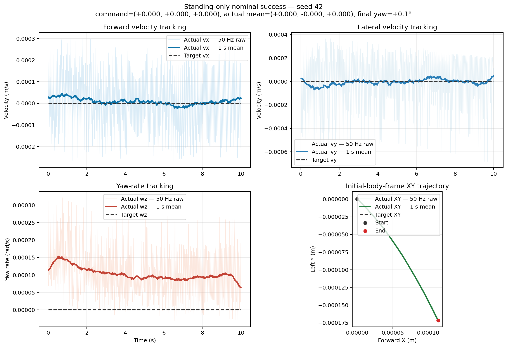
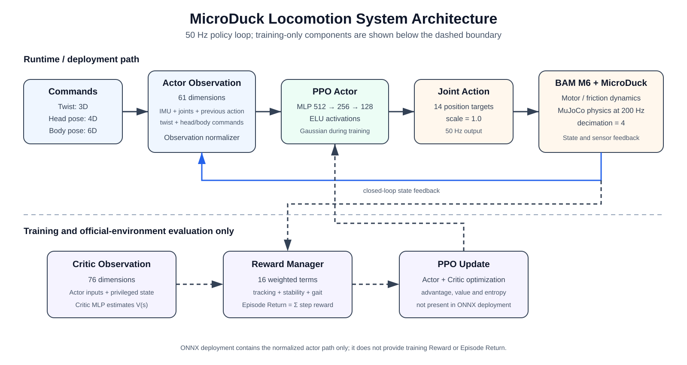

# Official Locomotion Baseline Report：MicroDuck model_5999

## 评测结论

`model_5999` 在名义 MuJoCo + BAM M6 部署形态下保持稳定，但速度指令跟踪未通过。
问题不是所有状态下固定向同一侧旋转，而是存在明显的命令区间失效、运动方向耦合
和正负方向不对称。

- 静止命令基本稳定，10 秒平均净偏航仅 `+0.06°`。
- `vx=+0.10 m/s` 时平均实际前进速度仅 `+0.001 m/s`，策略几乎不启动步态。
- `vx=+0.30 m/s` 和 `vx=-0.30 m/s` 均出现大幅弧线，且偏航方向随前进/后退
  翻转，说明缺陷与运动方向或步态相位耦合，而不是静止时的固定自转。
- 横移两侧均严重欠跟踪；正横移产生约 `-44.84°/10s` 的额外偏航，负横移仅
  `-6.21°/10s`，左右响应明显不对称。
- `wz=+0.50 rad/s` 能产生 `+0.359 rad/s`，但 `wz=-0.50 rad/s` 仅产生
  `-0.006 rad/s`。负向旋转几乎完全失效，是本轮最明确的策略缺陷。
- 160 个 Episode 均未跌倒，但“稳定站立或稳定走弧线”不能视为命令跟踪成功。

## 协议

- Policy：`microduck_velocity_flat_5999.onnx`
- 形态：官方 CPU MuJoCo、BAM M6、ONNX actor、50 Hz 控制
- Initial state：官方 Velocity reset 的根状态范围
- Seeds：每项指令共享 `42–61`，便于成对比较
- 每项：20 Episode；每个 Episode 预热 1 秒、评测 10 秒
- 总计：8 项指令、160 Episode、80,000 个测试控制步
- 所有测试点均位于官方训练范围内：`vx ∈ [-0.4, 0.4]`、
  `vy ∈ [-0.3, 0.3]`、`wz ∈ [-1.0, 1.0]`
- 这是部署形态评测，不加载训练环境 Reward Manager，因此没有 Episode Return

## Episode Return 补充评测

Episode Return 不能从上述 ONNX 部署轨迹中直接得到，因此另用官方
`ManagerBasedRlEnv` 和 PT checkpoint 运行了一组独立协议：

- Checkpoint：`model_5999.pt`，SHA256 为
  `530908b5f0d1ba043d02609445e5832cc7ff366b7e7b7d3bc5c3fe86045cfda6`。
- 恢复的课程计数：`144024`；评测使用 checkpoint 的最终奖励权重。
- 每项指令 5 个向量环境初始状态，跨指令使用相同 `pair_id=0–4`；全局
  base seed 为 `42`。
- 每个 Episode 10 秒、无预热，总计 8 指令 × 5 初始状态 = 40 Episode。
- 关闭观测噪声、推力和域随机化，固定头部/躯干指令为零；保留官方
  reset、终止条件、Reward Manager、BAM 执行器和最终课程状态。
- Episode Return 定义为 50 Hz 控制步上 `reward_buf` 的总和。

| 指令 `(vx, vy, wz)` | Episode Return 均值 | 总体标准差 | 提前终止 |
|---|---:|---:|---:|
| `(0.00, 0.00, 0.00)` | `88.23` | `0.14` | `0/5` |
| `(+0.10, 0.00, 0.00)` | `86.06` | `0.34` | `0/5` |
| `(+0.30, 0.00, 0.00)` | `82.59` | `0.48` | `0/5` |
| `(-0.30, 0.00, 0.00)` | `82.78` | `0.47` | `0/5` |
| `(0.00, +0.20, 0.00)` | `86.27` | `0.30` | `0/5` |
| `(0.00, -0.20, 0.00)` | `84.79` | `0.33` | `0/5` |
| `(0.00, 0.00, +0.50)` | `86.60` | `0.51` | `0/5` |
| `(0.00, 0.00, -0.50)` | `80.65` | `0.21` | `0/5` |
| **40 Episode 总体** | **`84.75`** | **`2.40`** | **`0/40`** |

这个 Return 是当前奖励函数下的相对比较指标，不是新的“成功率”。总 Return
中还包含直立、头部姿态和腿部姿态等奖励，因此稳定但跟踪失败的策略仍可以得到
较高 Return。不过，负向旋转的均值比正向旋转低 `5.95`，与已知的负向转向失效
一致。这也说明后续比较新模型时，应将 Return 与 Command Tracking Error 和
Nominal Success Rate 一起看，不能只优化一个总分。

## 汇总结果

| 指令 `(vx, vy, wz)` | 平均实际 `(vx, vy, wz)` | 10 秒净偏航 | Fall Rate | 平均 RMSE `(vx, vy, wz)` |
|---|---|---:|---:|---|
| `(0.00, 0.00, 0.00)` | `(0.000, 0.000, 0.000)` | `+0.06°` | `0%` | `(0.000, 0.000, 0.000)` |
| `(+0.10, 0.00, 0.00)` | `(+0.001, 0.000, 0.000)` | `+0.34°` | `0%` | `(0.099, 0.002, 0.015)` |
| `(+0.30, 0.00, 0.00)` | `(+0.173, +0.003, +0.291)` | `+166.68°` | `0%` | `(0.131, 0.103, 0.867)` |
| `(-0.30, 0.00, 0.00)` | `(-0.158, +0.008, -0.308)` | `-175.00°` | `0%` | `(0.146, 0.119, 0.698)` |
| `(0.00, +0.20, 0.00)` | `(+0.010, +0.056, -0.079)` | `-44.84°` | `0%` | `(0.026, 0.195, 0.329)` |
| `(0.00, -0.20, 0.00)` | `(+0.005, -0.031, -0.013)` | `-6.21°` | `0%` | `(0.014, 0.209, 0.410)` |
| `(0.00, 0.00, +0.50)` | `(+0.006, +0.007, +0.359)` | `+205.17°` | `0%` | `(0.016, 0.115, 0.416)` |
| `(0.00, 0.00, -0.50)` | `(0.000, 0.000, -0.006)` | `-3.43°` | `0%` | `(0.003, 0.002, 0.495)` |

## 典型轨迹

### 成功样本：仅站立静止

当前 baseline 只在零速度指令下达到项目定义的 Nominal Success。下图为固定
指令矩阵的 seed 42；10 秒内三轴平均速度接近零，最终航向变化约 `+0.1°`。
这张图只表示“站立静止成功”，不代表已学会合格运动。

### 失败样本：运动指令

400-Episode 随机基准中，300 个运动指令的 Nominal Success Rate 为 `0.0%`，
因此没有任何轨迹被标成“运动成功”。典型失败 Episode 322 和最严重失败
Episode 362 的三轴跟踪与机体坐标轨迹见
[`05_random_400`](../05_random_400/#代表性运动样本)。

## 系统理解

### Observation

Actor 输入共 61 维。最重要的设计是 Actor **不直接观测机体线速度**，而是根据
IMU、关节状态和历史 Action 学习闭环控制。

| Actor Observation | 维度 | 含义 |
|---|---:|---|
| `base_ang_vel` | 3 | 机体角速度 |
| `projected_gravity` | 3 | 机体坐标系中的重力方向 |
| `joint_pos` | 14 | 主动关节位置 |
| `joint_vel` | 14 | 主动关节速度 |
| `actions` | 14 | 上一控制步的 Action |
| `command` | 3 | `(vx, vy, wz)` 速度指令 |
| `head_command` | 4 | 头部关节姿态指令 |
| `body_command` | 6 | 躯干位置与姿态指令 |
| **合计** | **61** | |

Critic 在训练时使用 76 维特权观测，额外包含机体线速度、足部高度、腾空时间、
接触与接触力等信息。Critic 不会进入导出的 ONNX Actor。

### Action

Policy 每个控制步输出 14 维 Action，对应 14 个主动伺服关节的位置目标；
`JointPositionActionCfg.scale=1.0`。两个被动嘴部连杆关节不在 Actor 观测和
Action 中。BAM M6 执行器再将目标位置映射为带电机、摩擦与限幅特性的物理作用。

### Reward

`model_5999.pt` 恢复最终课程状态后启用 16 个奖励项。正权重用于跟踪、直立、
姿态和步态，负权重是动作、打滑、碰撞与限位惩罚。

| 类别 | 奖励项及最终权重 |
|---|---|
| 指令跟踪 | `track_linear_velocity=2.0`、`track_angular_velocity=2.0` |
| 身体/姿态 | `upright=2.0`、`pose=1.0`、`body_ang_vel=-0.05`、`angular_momentum=-0.02` |
| 动作/安全 | `dof_pos_limits=-1.0`、`action_rate_l2=-1.0`、`self_collisions=-1.0` |
| 脚部步态 | `air_time=3.0`、`foot_clearance=-2.0`、`foot_swing_height=-0.25`、`foot_slip=-0.1` |
| 头部/躯干 | `head_pose_tracking=2.0`、`body_pose_tracking=0.0`、`head_pose_bias=3.0` |

每步总 Reward 是已加权分项之和，并按 `dt` 缩放；Episode Return 是所有控制步
Reward 的总和。ONNX 部署形态不含 Reward Manager，所以不会产生训练 Return。

### Control Frequency

- MuJoCo 物理步长：`0.005 s`，即 200 Hz。
- Action decimation：`4`。
- Policy 与伺服控制周期：`0.02 s`，即 50 Hz。
- 本基准的 10 秒测试阶段对应 500 个 Policy 控制步。

### Policy Architecture

- Actor：`61 → 512 → 256 → 128 → 14`，隐藏层使用 ELU。
- Actor 输入包含 Empirical Observation Normalizer；训练时使用 Gaussian Action
  Distribution，本评测使用确定性推理输出。
- Critic：`76 → 512 → 256 → 128 → 1`，只在 PPO 训练中估计状态价值。
- 导出的 ONNX 包含 Actor Observation Normalizer 和 Actor MLP，不包含 Critic、
  Reward Manager 或 PPO 更新逻辑。

## 数据完整性

- 160/160 个 Episode 均有逐步 CSV。
- 每个 Episode 均完成 500 个测试控制步，即完整 10 秒。
- 20 个种子在 8 项指令中各出现一次。
- `fallen = false`：160/160。
- 评测循环在每步检查 Observation、Action、`qpos` 和 `qvel` 的有限性；没有
  Episode 因 NaN/Inf 提前结束。

## 产物

- 指令集：`evaluation/command_sets/command_response_20.json`
- 跨指令汇总：
  `results/week02/01_baseline_5999/summaries/command_response_20_microduck_velocity_flat_5999.json`
- Episode Return 汇总：
  `results/week02/01_baseline_5999/summaries/episode_return_8x5_model_5999.json`
- 站立静止成功轨迹：
  `results/week02/01_baseline_5999/figures/standing_success_seed42.png`
- 系统架构图：
  `results/week02/01_baseline_5999/figures/locomotion_system_architecture.svg`
- 跨指令图：
  `results/week02/01_baseline_5999/figures/command_response_20_model_5999.png`
- 单项 summary JSON：`results/week02/01_baseline_5999/summaries/`
- 逐步 CSV：`artifacts/week02/01_baseline_5999/raw/`（本地保留，不提交 Git）

## 下一步 Gate

成对种子的左右腿 Action 对比已经完成，结果见
[`03_action_symmetry`](../03_action_symmetry/)。Checkpoint 对比结果见
[`02_checkpoint_analysis`](../02_checkpoint_analysis/)，后续 symmetry 单变量训练结果见
[`04_symmetry_ab`](../04_symmetry_ab/)。
