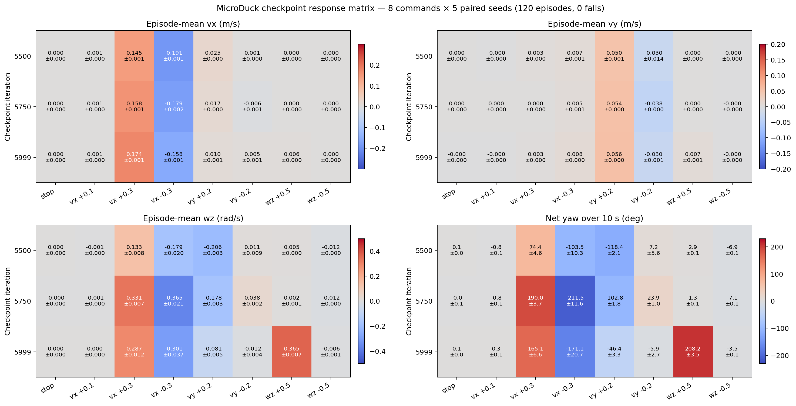

# Checkpoint 八指令对比：model_5500、model_5750 与 model_5999

## 结论

完整八指令结果确认：三个 checkpoint 都不能作为合格的通用速度控制器，而且训练后期发生的不是简单、单调的性能提升。

- `model_5500` 的直行偏航相对最小，但仍达到 `+74.4°/10 s`；正向横移还会引起 `-118.4°` 偏航。
- `model_5750` 的前进和后退分别产生约 `+190.0°` 与 `-211.5°` 偏航，是三个 checkpoint 中平移指令与旋转耦合最严重的阶段。
- `model_5999` 改善了横移时的偏航，并提高了前进速度，但仍保留巨大的前进/后退弧线；它只学会了 `wz=+0.5`，仍然忽略 `wz=-0.5`。
- 三个 checkpoint 对 `vx=+0.1` 都几乎没有响应，说明低速前进能力始终没有形成。

因此，`model_5999` 的单向转向并不是一个孤立问题。整个训练后期同时存在低速指令失效、平移与偏航耦合，以及正负方向响应不对称。

## 测试设置

- Checkpoint：`5500`、`5750`、`5999`。
- 指令：停止、`vx=+0.1`、`vx=+0.3`、`vx=-0.3`、`vy=+0.2`、`vy=-0.2`、`wz=+0.5`、`wz=-0.5`。
- 每项指令使用 5 个配对随机种子 `42–46`，共 120 个回合。
- 初始状态使用带固定随机种子的 `official_reset`；预热 1 秒，正式测量 10 秒。
- 使用带各 checkpoint 对应观测归一化器的官方 ONNX。
- 运行环境为 CPU MuJoCo 部署预演，使用 BAM M6 XL330 执行器模型，控制频率为 50 Hz。
- 120/120 个回合均完成全部 500 个测量控制步；0 次跌倒；无 NaN 或 Inf。
- 此部署预演基准不提供回合回报（Episode Return）。

## 主指令方向响应

表中为实际平均速度；每一列对应相应指令的主要速度维度。例如 `vx=+0.3` 列记录实际 `vx`，`vy=+0.2` 列记录实际 `vy`。

| Checkpoint | `vx=+0.1` | `vx=+0.3` | `vx=-0.3` | `vy=+0.2` | `vy=-0.2` | `wz=+0.5` | `wz=-0.5` |
|---:|---:|---:|---:|---:|---:|---:|---:|
| 5500 | +0.001 | +0.145 | -0.191 | +0.050 | -0.030 | +0.005 | -0.012 |
| 5750 | +0.001 | +0.158 | -0.179 | +0.054 | -0.038 | +0.002 | -0.012 |
| 5999 | +0.001 | +0.174 | -0.158 | +0.056 | -0.030 | +0.365 | -0.006 |

主要观察：

- `vx=+0.1` 的实际速度始终约为 `0.001 m/s`，三个 checkpoint 都基本保持原地不动。
- `vx=±0.3` 能产生部分前后运动，但只能达到目标绝对值的大约 48%–64%。
- `vy=±0.2` 的横移响应更弱，只达到目标绝对值的大约 15%–28%。
- 原地转向能力只在 `model_5999` 的正方向出现；负方向在全部 checkpoint 中都没有学会。

## 十秒净偏航

| 指令 | model_5500 | model_5750 | model_5999 |
|---|---:|---:|---:|
| 停止 | +0.1° | -0.0° | +0.1° |
| `vx=+0.1` | -0.8° | -0.8° | +0.3° |
| `vx=+0.3` | +74.4° | +190.0° | +165.1° |
| `vx=-0.3` | -103.5° | -211.5° | -171.1° |
| `vy=+0.2` | -118.4° | -102.8° | -46.4° |
| `vy=-0.2` | +7.2° | +23.9° | -5.9° |
| `wz=+0.5` | +2.9° | +1.3° | +208.2° |
| `wz=-0.5` | -6.9° | -7.1° | -3.5° |

图中每个单元格为 5 个随机种子的均值 ± 总体标准差。

## 结果解读

1. `model_5500` 只能被视为诊断 checkpoint。它的直行偏航相对较小，但后退和正向横移仍会产生严重偏航，同时不具备原地转向能力。
2. `model_5750` 表现出明显的旋转偏置放大。前进、后退以及两项横移指令都更容易转化为旋转，说明这一阶段并非稳定地接近目标速度映射。
3. `model_5999` 出现了能力交换：正向原地转向和前进速度有所改善，横移偏航减小，但负向原地转向仍然失效，前后移动仍是大弧线。
4. 这支持“策略进入了不对称局部解”的判断，不支持“训练越久，各项能力就会自然单调改善”的假设。

## 下一步

Checkpoint 诊断已经足以证明问题不是单个最终模型的偶然回放。接下来若要判断“继续训练是否能够自然学会负向转向”，应从 `model_5999` 保持配置不变继续训练，并更密集地保存 checkpoint，再重复本轮固定评测。若正向继续增强而负向仍接近零，就应转向镜像约束或更明确的正负转向平衡实验，而不是继续盲目增加训练迭代数。
