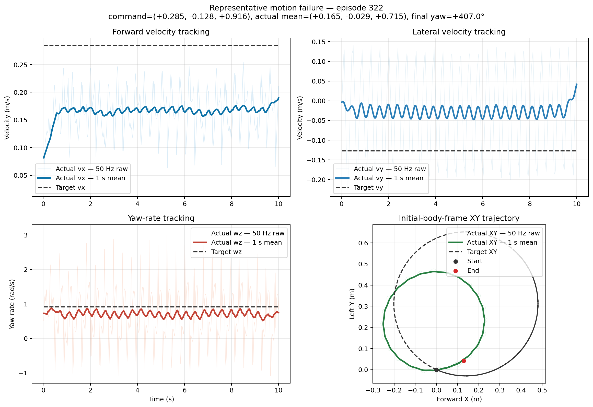
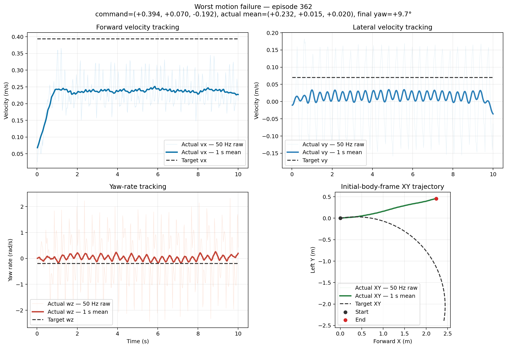

# MicroDuck 400-Episode 随机速度基准

日期：2026-09-11

## 协议

- 模型：`microduck_velocity_flat_5999.onnx`
- Episode：400
- Reset seeds：42–441
- Command seed：20260911
- 指令范围：`vx [-0.4, 0.4]`、`vy [-0.3, 0.3]`、`wz [-1.0, 1.0]`
- 显式评测配额：25% 静止、15% 原地转向、60% 全范围均匀采样
- 该配额来自最终训练配置中的 standing/turn buckets，但为便于分桶统计而设为互斥；不是对训练采样器执行顺序的逐项复刻
- 每个 Episode：1 秒零指令预热 + 10 秒测试，官方 reset，CPU MuJoCo + BAM M6
- 部署形态 ONNX 评测不加载 Reward Manager，因此 `Episode Return` 不可用

## 与固定八指令矩阵的关系

此前的固定矩阵包含 8 条轴向隔离指令 × 20 seeds，共 160 个 Episode；它适合
诊断前进、后退、横移和转向的单项缺陷。本次 400 个 Episode 覆盖同时出现的
vx/vy/wz 组合以及显式 standing/turn buckets。两套协议互补，结果分别报告，
不合并为一个成功率，也不把重复子集再次计数。

## 数据完整性

- 汇总 Episode：400
- 原始 CSV：400
- CSV 总行数：220000
- 每个 CSV 字段数：95
- 缺失文件：0
- 行数不一致：0
- 非有限数值：0

## 项目定义的 Nominal Success

这不是上游官方指标。本项目把“未跌倒，且每个轴的 RMSE 不超过该轴命令幅值
的 30%”定义为一次 nominal success。为避免零命令被数值噪声误判，vx/vy/wz
分别使用 0.03 m/s、0.03 m/s、0.10 rad/s 的最小容差。这个混合门槛也能避免
把低速指令完全不响应错误地计为成功。

- 运动指令 Nominal Success Rate：**0.0%**（排除静止 Episode）
- 全部 Episode Nominal Success Rate：25.0%（包含 100 个静止 Episode）
- Fall Rate：**0.0%**
- vx / vy / wz 单轴通过率：44.2% / 32.2% / 26.8%

## 分桶结果

| Bucket | Episodes | Success Rate | Fall Rate | Mean RMSE vx | Mean RMSE vy | Mean RMSE wz |
| --- | ---: | ---: | ---: | ---: | ---: | ---: |
| general | 240 | 0.0% | 0.0% | 0.108 | 0.164 | 0.584 |
| standing | 100 | 100.0% | 0.0% | 0.000 | 0.000 | 0.000 |
| turn_in_place | 60 | 0.0% | 0.0% | 0.013 | 0.076 | 0.466 |

## 指令响应

| 轴 | 响应斜率 | 相关系数 | Episode 均值绝对误差 |
| --- | ---: | ---: | ---: |
| vx | 0.517 | 0.986 | 0.063 m/s |
| vy | 0.218 | 0.964 | 0.067 m/s |
| wz | 0.801 | 0.913 | 0.146 rad/s |

原地转向继续呈现方向和幅值相关的非线性：

- 正向：命令均值 +0.681，实际均值 +0.518 rad/s，成功率 0.0%
- 负向：命令均值 -0.677，实际均值 -0.290 rad/s，成功率 0.0%

静止 Episode 全部通过，但 300 个运动指令仅 0.0% 通过；因此不能用包含静止样本的 25.0% 作为控制器质量结论。

## 代表性运动样本

- 合格成功样本：无。
- 典型失败：Episode 322，seed 364，命令 `(+0.285, -0.128, +0.916)`，RMSE `(0.125, 0.145, 0.820)`。
- 最严重失败：Episode 362，seed 404，命令 `(+0.394, +0.070, -0.192)`，RMSE `(0.170, 0.110, 0.952)`。

下图都是“未跌倒但指令跟踪失败”，不得根据稳定性将它们重新标记为成功。
每张图同时展示 `vx/vy/wz` 的 Target vs Actual 和对齐初始朝向的 XY 轨迹。

### 典型运动失败：Episode 322

### 最严重运动失败：Episode 362

## 结论

该模型在 400 个 Episode 中保持 0% Fall Rate，说明 nominal 稳定性较好；但
300 个运动指令的成功率为 0%，速度跟踪门禁明确失败。该结果完成第二周
Locomotion Benchmark 的随机指令基线，但该 ONNX 不能冻结为导航控制器。

处理后汇总：
`results/week02/05_random_400/summaries/random_velocity_400_processed.json`

包含 400 个 Episode 的源汇总保存在本地：
`artifacts/week02/05_random_400/run/summary/random_velocity_400_microduck_velocity_flat_5999.json`
