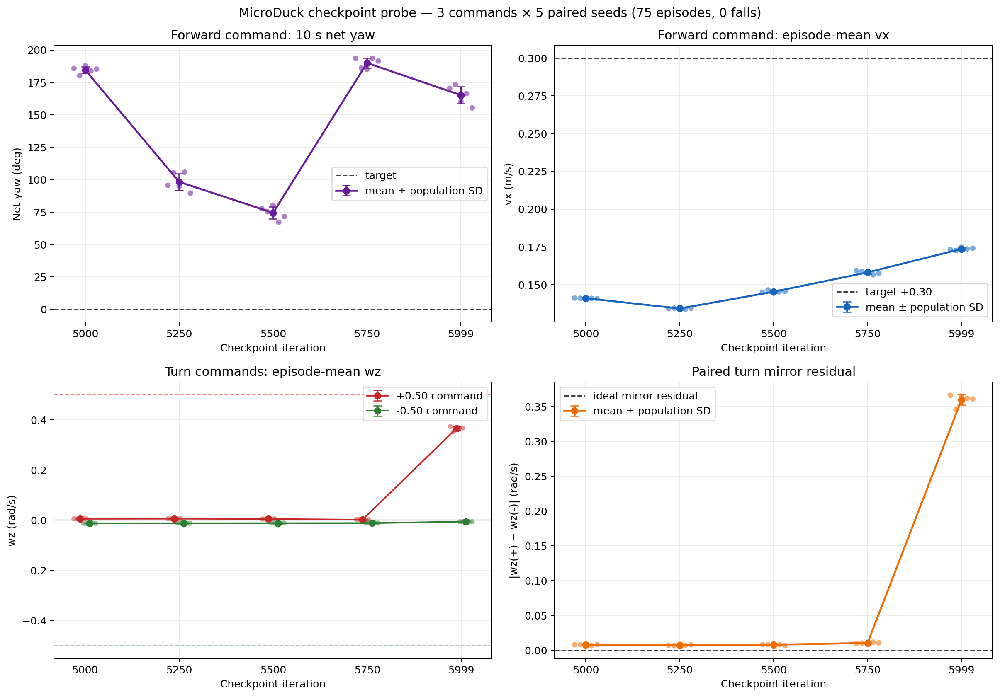

# Checkpoint comparison: model_5000 to model_5999

## Outcome

None of the five checkpoints is an acceptable general velocity controller. The behavior does not improve monotonically during the final 1000 training iterations:

- `model_5500` has the smallest straight-command yaw drift, but still turns `+74.4°` in 10 seconds and reaches only `0.145 m/s` for a `0.30 m/s` command.
- `model_5750` regresses sharply to `+190.0°` straight-command yaw drift.
- `model_5999` has the highest forward speed (`0.174 m/s`) and is the first checkpoint in this probe to respond materially to `wz=+0.5`, but it still ignores `wz=-0.5`. The late positive-turn skill therefore creates the strong left/right asymmetry seen in the final policy.

## Protocol

- Checkpoints: `5000`, `5250`, `5500`, `5750`, `5999`.
- Policy format: official ONNX export with each checkpoint's observation normalizer baked in.
- Commands: `(vx, vy, wz) = (0.30, 0, 0)`, `(0, 0, +0.50)`, `(0, 0, -0.50)`.
- Episodes: 5 paired seeds per command and checkpoint, seeds `42–46`; 75 total episodes.
- Reset: seeded `official_reset`; warm-up 1 second; measured duration 10 seconds.
- Runtime: CPU MuJoCo deployment rehearsal with BAM M6 XL330 actuators at 50 Hz.
- Result integrity: 75/75 episodes completed all 500 measured control steps; 0 falls; no missing raw CSV files.
- Episode return is unavailable in this deployment-rehearsal benchmark.

## Results

Values are mean ± population standard deviation across five seeds.

| Checkpoint | Forward net yaw (deg) | Forward actual vx (m/s) | Actual wz at +0.5 | Actual wz at -0.5 | Turn mirror residual |
|---:|---:|---:|---:|---:|---:|
| 5000 | +184.55 ± 2.51 | 0.14095 ± 0.00019 | +0.00521 ± 0.00033 | -0.01271 ± 0.00025 | 0.00750 ± 0.00052 |
| 5250 | +98.24 ± 6.31 | 0.13414 ± 0.00028 | +0.00560 ± 0.00034 | -0.01247 ± 0.00028 | 0.00687 ± 0.00043 |
| 5500 | +74.38 ± 4.63 | 0.14524 ± 0.00069 | +0.00460 ± 0.00036 | -0.01224 ± 0.00047 | 0.00764 ± 0.00052 |
| 5750 | +189.96 ± 3.71 | 0.15807 ± 0.00098 | +0.00161 ± 0.00071 | -0.01188 ± 0.00023 | 0.01026 ± 0.00055 |
| 5999 | +165.15 ± 6.60 | 0.17361 ± 0.00077 | +0.36544 ± 0.00736 | -0.00584 ± 0.00065 | 0.35960 ± 0.00739 |

The turn mirror residual is computed per paired seed as `|mean_wz(+0.5) + mean_wz(-0.5)|`. A low value is necessary for mirrored turning, but is not sufficient: checkpoints 5000–5750 score a low residual only because both turn commands are nearly ignored.

## Interpretation

1. Straight walking and yaw control are not improving together. Forward speed generally increases after 5250, while straight-line yaw first improves, then collapses at 5750, and remains poor at 5999.
2. The final one-sided turning behavior appears late. Checkpoints 5000–5750 do not meaningfully execute either turn direction; `model_5999` executes only the positive direction.
3. `model_5500` is useful as a diagnostic checkpoint, not as a replacement controller. Its straight drift is less severe than the final policy, but `+74°/10 s` is still a large tracking failure and it lacks turning.
4. Five seeds are enough to expose these large effects and locate the transition interval. They are not enough for final acceptance or a precise probability estimate of rare failures.

## Next comparison

The most informative next step is to narrow the late transition using any available checkpoints between 5750 and 5999. If only the current five checkpoints exist, compare `model_5500`, `model_5750`, and `model_5999` on the full eight-command matrix before changing training configuration. That will distinguish a broad late-stage collapse from a yaw-specific one-sided skill transition.
