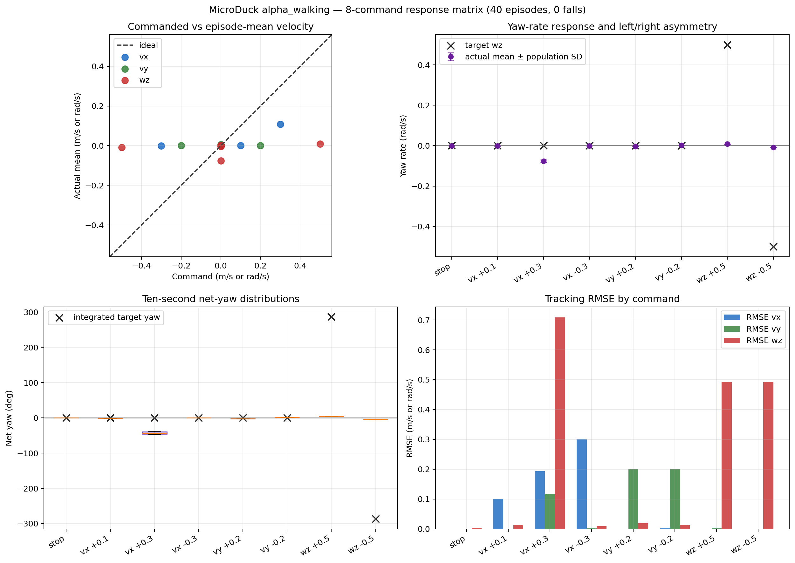

# 官方 `alpha_walking.onnx` 八指令快筛

日期：2026-09-13

## 结论

官方模型通过了文件完整性、ONNX Checker、CPU Runtime 和 `61 → 14` I/O 合约
检查，但在当前官方 CPU MuJoCo + BAM M6 部署复现链中没有通过运动指令快筛：

- 40 个 Episode 均未跌倒；
- 静止 5/5 通过项目门槛；
- 35 个运动 Episode 均未通过，运动指令成功率为 **0%**；
- `vx=+0.3` 产生有限前进，实际均值仅 `+0.108 m/s`，同时 10 秒净偏航
  `-42.9°`；
- 后退、正负横移和正负原地转向几乎都保持静止。

因此当前不能把该 ONNX 直接冻结为 PointGoal Navigation 的底层控制器，也不应
立即升级到八指令 × 20 seeds、400-Episode 随机指令或完整 OOD 鲁棒性扫描。

后续兼容性排查已确认 Observation、内嵌 Normalizer、关节顺序和 ONNX 前向计算
没有接错。使用官方浏览器演示的同哈希模型、旧版精确 MJCF、理想位置执行器和
MuJoCo 3.11，仍能复现从静止无法正常启动后退、横移和负向转动的问题。模型在先
前进约 1 秒、进入周期步态后可恢复双向响应，但仍显著欠跟踪。因此它可作为受限
Viewer/PointGoal 原型参考，仍不能直接冻结为最终通用导航底层。详细证据见
[`compatibility_diagnosis.md`](./compatibility_diagnosis.md)。

## 模型来源与完整性

| 项目 | 记录值 |
| --- | --- |
| 发布方 | `pollen-robotics` |
| Hugging Face 仓库 | `pollen-robotics/microduck-policies` |
| Revision | `088524a64e2557dc453256b6071dbb9d23888802` |
| 文件 | `alpha_walking.onnx` |
| 文件大小 | 793705 bytes |
| SHA-256 | `e36332d383997d51401897734cd3e79cf5038406feddb18b4d57ecfb141daa6c` |
| Manifest | schema 2、model API 1、61 obs、14 actions、50 Hz |
| 评测使用的 `microduck_rl` Commit | `844acfd508f30d4260dafdee98a2d7c9dfbe6bd4` |
| ONNX Producer | PyTorch 2.9.1 |
| ONNX Opset | 18 |

模型与 manifest 保存在本地：

```text
artifacts/week03/01_official_alpha_walking/model/
├── alpha_walking.onnx
└── manifest.json
```

`artifacts/` 已被 Git 忽略，不提交模型大文件。

## 静态检查

| 检查项 | 结果 |
| --- | --- |
| ONNX Checker | 通过 |
| CPU Execution Provider | 加载通过 |
| 输入 | `obs: float32[1,61]` |
| 输出 | `actions: float32[1,14]` |
| 零输入输出 | 14 个有限值，无 NaN/Inf |
| Joint metadata | 14 个关节，顺序与当前推理链一致 |
| Command metadata | `twist, head_pose, body_pose` |
| Action scale | `1.0` |

## 快筛协议

- 指令：静止、`vx=+0.1`、`vx=+0.3`、`vx=-0.3`、`vy=±0.2`、`wz=±0.5`
- 每条指令：5 个 Episode
- Reset seeds：42–46，在八条指令间成对复用
- 每个 Episode：1 秒零指令预热 + 10 秒测试
- 初始状态：官方 reset 范围
- 执行环境：CPU MuJoCo + BAM M6 XL330
- 控制频率：50 Hz
- Reward：部署形态 ONNX 评测不加载 Reward Manager，因此不可用

## 汇总结果

| 指令 | 平均实际 `(vx, vy, wz)` | 10 秒净偏航 | 平均 RMSE `(vx, vy, wz)` | Fall Rate |
| --- | --- | ---: | --- | ---: |
| 静止 | `(-0.0000, +0.0000, -0.0006)` | `-0.3°` | `(0.0007, 0.0002, 0.0029)` | 0% |
| `vx=+0.1` | `(+0.0004, +0.0001, -0.0013)` | `-0.7°` | `(0.0997, 0.0011, 0.0132)` | 0% |
| `vx=+0.3` | `(+0.1078, +0.0048, -0.0764)` | `-42.9°` | `(0.1938, 0.1173, 0.7087)` | 0% |
| `vx=-0.3` | `(-0.0003, +0.0003, -0.0006)` | `-0.3°` | `(0.2997, 0.0015, 0.0093)` | 0% |
| `vy=+0.2` | `(+0.0001, +0.0002, -0.0042)` | `-2.4°` | `(0.0007, 0.1998, 0.0189)` | 0% |
| `vy=-0.2` | `(+0.0002, +0.0001, +0.0018)` | `+1.1°` | `(0.0015, 0.2001, 0.0133)` | 0% |
| `wz=+0.5` | `(+0.0002, +0.0003, +0.0080)` | `+4.8°` | `(0.0011, 0.0018, 0.4928)` | 0% |
| `wz=-0.5` | `(+0.0002, +0.0001, -0.0080)` | `-4.7°` | `(0.0010, 0.0004, 0.4926)` | 0% |

按项目定义的每轴 RMSE 门槛统计：

- 静止成功率：100%（5/5）；
- 运动指令成功率：0%（0/35）；
- 包含静止的总体成功率：12.5%（5/40）；
- Fall Rate：0%（0/40）。



## 当前判断与下一步

兼容性复核已经完成。当前安排为：

1. 保留原八指令 × 5 seeds 结果，作为“从静止 + BAM nominal”协议；
2. Viewer 人工演示可使用理想位置执行器和 1 秒前进预启动，但不把该补偿计入
   固定八指令成功率；
3. 不为该模型运行八指令 × 20、400-Episode 随机指令和完整 OOD 预算；
4. 将它记录为官方参考失败样本，开始单变量自训练候选；
5. 只有自训练候选通过 Nominal 门槛后，才升级到 Reality Gap 鲁棒性扫描。

## 结果文件

- 关键机器可读汇总：
  `results/week03/01_official_alpha_walking/summaries/official_alpha_walking_quick_screen.json`
- 图表：
  `results/week03/01_official_alpha_walking/figures/command_response_8x5_alpha_walking.png`
- 本地逐命令汇总与40个原始 CSV：
  `artifacts/week03/01_official_alpha_walking/quick_screen/`
