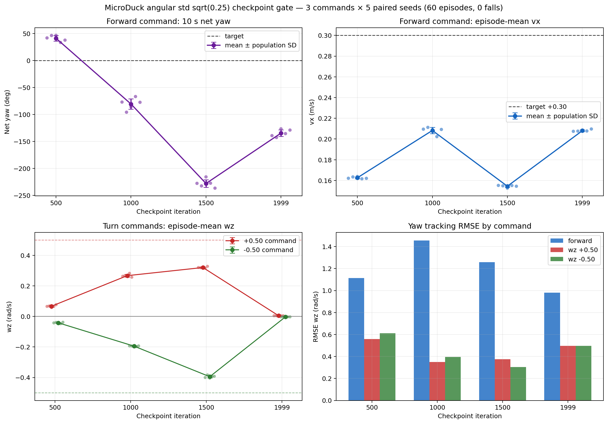
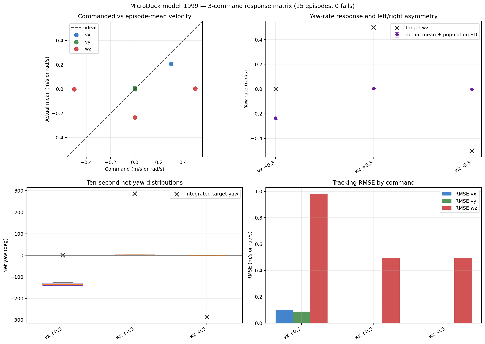
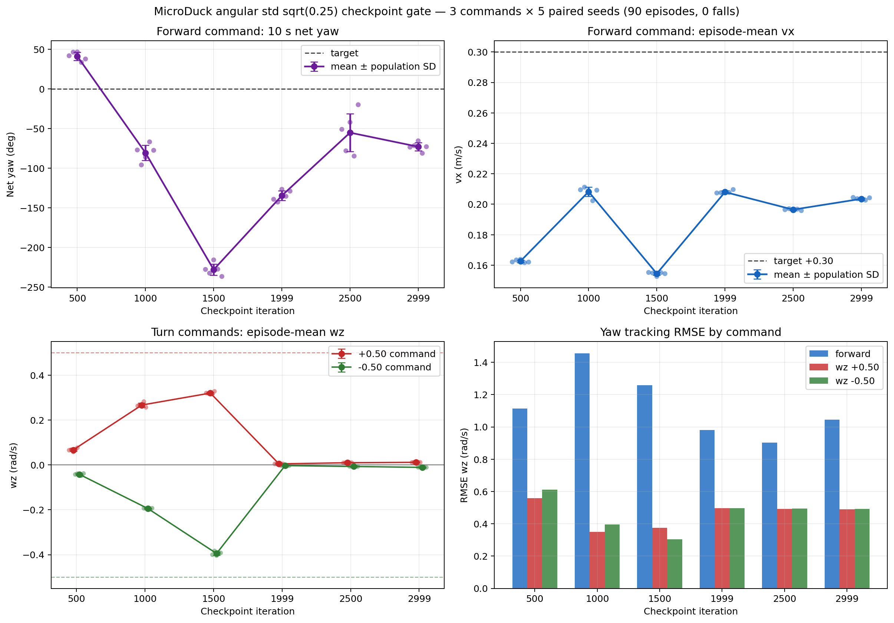

# Angular tracking std 单变量候选 A

日期：2026-09-14 至 2026-09-15

## 当前状态

训练前配置、测试、CUDA 冒烟、25-iteration 预运行、4096-env 正式训练、
2000-iteration Checkpoint Gate 和原配置诊断续训至 3000 iterations 均已完成。
本实验保留 `model_5999` 作为失败 Control，候选 A 从头训练，只收紧
`track_angular_velocity.std`。`model_2500` 和 `model_2999` 的补充 Gate 仍未
通过，训练指标也已接近平台；停止候选 A，不再续训到 4000/6000。

## 基线溯源

| 项目 | 值 |
| --- | --- |
| 原始训练 commit | `29e887ecfbf5d37144759e5a9f8a176dfb83d547` |
| 原始训练工作区 | clean，保存的 Git diff 为空 |
| Control checkpoint | `model_5999.pt` |
| Control seed / envs | `42 / 4096` |
| Control angular std | `sqrt(0.5)` |
| 候选开发基线 | 本地 `develop@53b8971` |
| 候选分支 | `codex/angular-std-025` |

`29e887e..53b8971` 只增加视觉和公寓场景文件，未修改 velocity 训练
配置。本次不基于已包含 symmetry 续训代码的分支，也不引入远端
`develop` 后续的机器人常量变更。

## 唯一训练变量

```text
Control:      track_angular_velocity.std = sqrt(0.5)  ~= 0.7071
Candidate A:  track_angular_velocity.std = sqrt(0.25) = 0.5000
```

保持不变：Reward weight、command sampling、Domain Randomization、PPO 参数、
training seed、环境数量和 Observation/Action 合约。不启用 mirror loss。

## 候选 Task 与默认门禁

```text
Task:             Mjlab-Velocity-Flat-Angular-Std025-MicroDuck
experiment_name:  velocity_angular_std025
run_name:         angular-std025-seed42-from-scratch
seed:             42
resume:           false
save_interval:    250
max_iterations:   2000
```

默认在 2000 iterations 停止，不会自动继续到 4000/6000。

## 训练顺序

### 1. CUDA 冒烟测试

```bash
cd ~/projects/microduck_rl

uv run train Mjlab-Velocity-Flat-Angular-Std025-MicroDuck \
  --env.scene.num-envs 64 \
  --agent.max-iterations 5 \
  --agent.run-name angular-std025-seed42-smoke-64x5
```

### 2. 25-iteration 预运行

```bash
cd ~/projects/microduck_rl

uv run train Mjlab-Velocity-Flat-Angular-Std025-MicroDuck \
  --env.scene.num-envs 64 \
  --agent.max-iterations 25 \
  --agent.run-name angular-std025-seed42-prerun-64x25
```

### 3. 正式训练到 2000-iteration Gate

```bash
cd ~/projects/microduck_rl

uv run train Mjlab-Velocity-Flat-Angular-Std025-MicroDuck \
  --env.scene.num-envs 4096
```

训练前两步只用于拒绝配置错误、NaN、明显跌倒和 Reward 异常，不用
64-env 小批结果判定最终策略质量。

## Checkpoint Gate

在 `500 / 1000 / 1500 / 2000` checkpoints 分别导出 ONNX，并用
[`angular_std025_gate_5.json`](../../../evaluation/command_sets/angular_std025_gate_5.json)
运行三指令 × 5 seeds 配对快筛：

```text
vx=+0.3
wz=+0.5
wz=-0.5
```

同时检查速度 RMSE、直行净偏航、正负转向方向、Fall Rate、NaN 和
Action 平滑性。只有 2000-iteration Gate 通过后才续训到 4000/6000。
本次 2000 Gate 未通过后的 3000-iteration 延长仅用于判断最终 curriculum 下
是否仍在收敛，不视为通过长期训练门禁。

## 验证记录

- [x] 候选 Task 已注册。
- [x] 候选与基线环境配置只有 angular std 不同。
- [x] Runner 从头训练、seed 42、symmetry 关闭。
- [x] `64 envs x 5 iterations` CUDA 冒烟测试。
- [x] `64 envs x 25 iterations` 预运行。
- [x] `4096 envs x 2000 iterations` 正式训练。
- [x] 导出并校验 `500 / 1000 / 1500 / 1999` 四个 ONNX。
- [x] 每个 checkpoint 完成三指令 x 5 seeds 配对快筛。
- [x] 从 `model_1999.pt` 保持原配置诊断续训至 `model_2999.pt`。
- [x] 导出并校验 `model_2500 / model_2999` ONNX，完成补充 Gate。

### 2026-09-14 冒烟与预运行结果

| 项目 | `64 x 5` 冒烟 | `64 x 25` 预运行 |
| --- | ---: | ---: |
| 最终 iteration | 4 | 24 |
| 最终 checkpoint | `model_4.pt` | `model_24.pt` |
| 中位 iteration 耗时 | - | `0.935 s` |
| 中位吞吐 | - | `1643 steps/s` |
| 非有限 TensorBoard 标量 | 0 | 0 |
| `nan_state` 最大值 | 0 | 0 |

两个 Run 的保存配置均为 `64 envs`、seed 42、`std=0.5`、
`resume=false`。预运行早期仍频繁跌倒且 Episode 较短，符合从随机策略开始的
25-iteration 现象；该结果只通过配置可运行与 NaN 拒绝门禁，不作为策略
质量结论。

### 2026-09-14 正式训练与 Checkpoint Gate

正式训练使用 `4096 envs`、seed 42 和 `std=0.5`。训练在约 750 iterations
临时停止，随后从 `model_750.pt` 恢复至最终 `model_1999.pt`；checkpoint 中的
`common_step_counter` 连续增长，curriculum 没有因恢复训练而重置。由于迭代
从 0 编号，计划中的 2000-iteration checkpoint 对应 `model_1999.pt`。

四个 PT checkpoint 均通过官方 `scripts/export.py` 导出，ONNX checker、有限
输出和 `Observation 61 -> Action 14` 合约均通过。每个 checkpoint 独立运行
3 条指令 x 5 seeds，共 60 Episode；以下均为 10 秒测试段的五 Episode 均值：

| Checkpoint | 前进 `vx` / RMSE | 前进 `wz` / 净偏航 | `wz=+0.5` 实际值 / RMSE | `wz=-0.5` 实际值 / RMSE | Fall Rate | Gate |
| --- | ---: | ---: | ---: | ---: | ---: | --- |
| `model_500` | `+0.163 / 0.139` | `+0.073 / +41.1 deg` | `+0.067 / 0.558` | `-0.042 / 0.612` | `0%` | 未通过 |
| `model_1000` | `+0.208 / 0.101` | `-0.142 / -80.7 deg` | `+0.267 / 0.351` | `-0.195 / 0.395` | `0%` | 未通过 |
| `model_1500` | `+0.155 / 0.149` | `-0.394 / -228.0 deg` | `+0.320 / 0.375` | `-0.395 / 0.303` | `0%` | 未通过 |
| `model_1999` | `+0.208 / 0.101` | `-0.235 / -134.7 deg` | `+0.005 / 0.496` | `-0.003 / 0.497` | `0%` | 未通过 |

完整的跨 checkpoint 聚合指标、配对 seeds、Policy SHA256、非有限数检查和
Action 变化统计见
[`checkpoint_gate_500_1999.json`](summaries/checkpoint_gate_500_1999.json)。



最终 checkpoint 的三指令响应如下。图中的目标转向为 `±0.5 rad/s`，实际
响应接近零；前进指令下则存在明显负向 yaw。



所有原始 CSV 数值均为有限值。测试段相邻 Action 的 L2 变化均值从
`0.478`（500）下降到 `0.141`（1999），但动作更平滑没有转化为合格的命令
跟踪。

`model_1000` 和 `model_1500` 已能按正负命令给出正确转向方向，但直行偏航
持续恶化；`model_1999` 的原地正负转向又退化到接近零响应，同时直行仍有
显著负向偏航。该结果与训练过程中偏低的 `track_angular_velocity` 一致，表明
它不是仅由训练指标尺度造成的观感问题，而是闭环策略质量缺陷。

阶段结论：候选 A 在 2000 iterations 时不满足正式续训门槛。考虑到
`standing_envs` 和 `head_pose_range` 的最终 curriculum 阶段在 2000 附近才
生效，且 W&B 训练指标仍未进入平台，下一步保持 std、seed 和其余配置不变，
诊断续训至 3000，并在约 2500 和 3000 重复相同 Gate。该延长不代表当前
checkpoint 已通过；如果闭环转向仍接近零或直行偏航没有改善，则停止候选。

### 2026-09-15 诊断续训与最终 Gate

诊断续训从 `model_1999.pt` 恢复，保持 `4096 envs`、seed 42、`std=0.5`、
PPO 参数和其余环境配置不变，额外运行 1001 iterations：

```text
logs/rsl_rl/velocity_angular_std025/
  2026-09-15_10-01-10_angular-std025-seed42-resume-1999-to-3000
```

`model_2500.pt` 和 `model_2999.pt` 的内部 iteration 分别为 2500 和 2999，
`common_step_counter` 分别为 60072 和 72048，确认恢复后训练进度连续。
TensorBoard 共检查 44 个 scalar tags，未发现非有限值。

两个 checkpoint 均通过官方导出脚本、ONNX checker、有限输出检查和
`Observation 61 -> Action 14` 合约验证。继续使用同一三指令、seeds 42--46，
每个 checkpoint 运行 15 Episode：

| Checkpoint | 前进 `vx` / RMSE | 前进 `wz` / 净偏航 | `wz=+0.5` 实际值 / RMSE | `wz=-0.5` 实际值 / RMSE | Fall Rate | Gate |
| --- | ---: | ---: | ---: | ---: | ---: | --- |
| `model_2500` | `+0.197 / 0.108` | `-0.097 / -55.2 deg` | `+0.010 / 0.492` | `-0.007 / 0.494` | `0%` | 未通过 |
| `model_2999` | `+0.204 / 0.103` | `-0.127 / -73.0 deg` | `+0.011 / 0.491` | `-0.011 / 0.493` | `0%` | 未通过 |

完整六 checkpoint 聚合结果见
[`checkpoint_gate_500_2999.json`](summaries/checkpoint_gate_500_2999.json)。六个
checkpoint 共 90 Episode，全部无跌倒，但这只说明稳定性，没有满足命令跟踪
门槛。




从 2500 到 2999，最后 100 点均值中 `error_vel_yaw` 从 `1.3579` 降到
`1.3150`，线性趋势约为每 100 iterations `-0.0087`；
`track_angular_velocity` 从 `0.3730` 升到 `0.3954`，趋势约为每 100 iterations
`+0.0056`。指标仍有小幅改善，但变化已经较慢，且没有转化成部署闭环中的转向
响应：正负 `0.5 rad/s` 指令的实际角速度仍只有约 `+0.011/-0.011 rad/s`。

最终结论：候选 A 在最终 curriculum 下延长至 3000 iterations 后仍未恢复
转向能力，直行净偏航相对 `model_1999` 虽有改善，但从 `model_2500` 到
`model_2999` 又由 `-55.2 deg` 恶化至 `-73.0 deg`。因此停止该候选，不继续到
4000/6000。该单次 seed 结果不能单独证明收紧 std 是缺陷的唯一原因，但足以
判定当前配置不应成为冻结的 locomotion policy。

### 2026-09-15 官方 PT Reward / Return 诊断

为区分部署链路问题与训练目标问题，使用官方 PT 环境、Reward Manager 和
checkpoint curriculum，对 `model_1500.pt` 与 `model_1999.pt` 重复相同三指令、
seeds 42--46。每个 checkpoint 独立运行 15 Episode；关闭观测噪声、推力和
Domain Randomization，固定 head/body command 为零，不与 ONNX Gate 的 Episode
合并计数。

| Checkpoint | 前进 Return | `wz=+0.5` Return | `wz=-0.5` Return | 15-Episode 平均 Return | 提前终止 |
| --- | ---: | ---: | ---: | ---: | ---: |
| `model_1500` | `78.938` | `80.932` | `80.600` | `80.157` | `0 / 15` |
| `model_1999` | `78.910` | `75.359` | `74.596` | `76.288` | `0 / 15` |

前进指令的 Return 基本不变；`model_1999` 的正负转向 Return 分别下降 `5.573`
和 `6.005`。转向指令下的关键已加权 Reward Return 如下：

| Checkpoint / 指令 | `track_angular_velocity` | `track_linear_velocity` | `upright` | `pose` | `air_time` | `action_rate_l2` |
| --- | ---: | ---: | ---: | ---: | ---: | ---: |
| `1500 / wz+` | `7.163` | `16.791` | `18.607` | `9.396` | `11.364` | `-0.692` |
| `1500 / wz-` | `7.338` | `16.940` | `18.795` | `9.420` | `10.752` | `-0.696` |
| `1999 / wz+` | `7.440` | `19.970` | `19.727` | `9.883` | `0.000` | `-0.014` |
| `1999 / wz-` | `7.425` | `19.968` | `19.793` | `9.881` | `0.000` | `-0.015` |

`model_1999` 在两个转向指令下都取得零 `air_time`、接近零 Action 变化惩罚，
同时线速度、直立和姿态项接近满分，表明它选择了“原地站立并忽略 yaw”的局部
最优。更关键的是，其 `track_angular_velocity` Return 并未低于会转向的
`model_1500`。结合当前 Reward 将 yaw error 与 roll/pitch 角速度平方和放在同一
指数核内，可判断行走转向产生的机身摆动抵消了 yaw 误差改善，使该项无法有效
区分“正确转向”和“静止不转”。

原始官方评测结果保存在被 Git 忽略的本地产物中：

```text
artifacts/week03/02_angular_std025_candidate/model_1500/summary/
  episode_return_angular_std025_gate_5_model_1500.json
artifacts/week03/02_angular_std025_candidate/model_1999/summary/
  episode_return_angular_std025_gate_5_model_1999.json
```

诊断结论：这次退化发生在官方 PT 环境中，不是 ONNX 导出独有问题。下一轮最有
针对性的单变量实验应保留 `std=0.5` 和独立 `body_ang_vel` 惩罚，只把
`track_angular_velocity` 改为 yaw-only 指数 Reward；在该实验前不同时修改
command curriculum、action-rate 权重或 symmetry。

## 图表复现

跨 checkpoint 汇总和主图由
[`plot_checkpoint_gate.py`](../../../evaluation/plot_checkpoint_gate.py) 从被 Git
忽略的 suite JSON 与原始 CSV 生成；最终 checkpoint 图复用
[`plot_command_response.py`](../../../evaluation/plot_command_response.py)。依赖
官方环境执行：

```bash
cd ~/projects/microduck_rl

uv run python ~/projects/microduck-embodied/evaluation/plot_checkpoint_gate.py \
  --suite ~/projects/microduck-embodied/artifacts/week03/02_angular_std025_candidate/model_500/summary/angular_std025_gate_5_model_500.json \
  --suite ~/projects/microduck-embodied/artifacts/week03/02_angular_std025_candidate/model_1000/summary/angular_std025_gate_5_model_1000.json \
  --suite ~/projects/microduck-embodied/artifacts/week03/02_angular_std025_candidate/model_1500/summary/angular_std025_gate_5_model_1500.json \
  --suite ~/projects/microduck-embodied/artifacts/week03/02_angular_std025_candidate/model_1999/summary/angular_std025_gate_5_model_1999.json \
  --suite ~/projects/microduck-embodied/artifacts/week03/02_angular_std025_candidate/model_2500/summary/angular_std025_gate_5_model_2500.json \
  --suite ~/projects/microduck-embodied/artifacts/week03/02_angular_std025_candidate/model_2999/summary/angular_std025_gate_5_model_2999.json \
  --summary-output ~/projects/microduck-embodied/results/week03/02_angular_std025_candidate/summaries/checkpoint_gate_500_2999.json \
  --figure-output ~/projects/microduck-embodied/results/week03/02_angular_std025_candidate/figures/checkpoint_gate_500_2999.png

uv run python ~/projects/microduck-embodied/evaluation/plot_command_response.py \
  --suite ~/projects/microduck-embodied/artifacts/week03/02_angular_std025_candidate/model_2999/summary/angular_std025_gate_5_model_2999.json \
  --output ~/projects/microduck-embodied/results/week03/02_angular_std025_candidate/figures/model_2999_command_response.png
```
