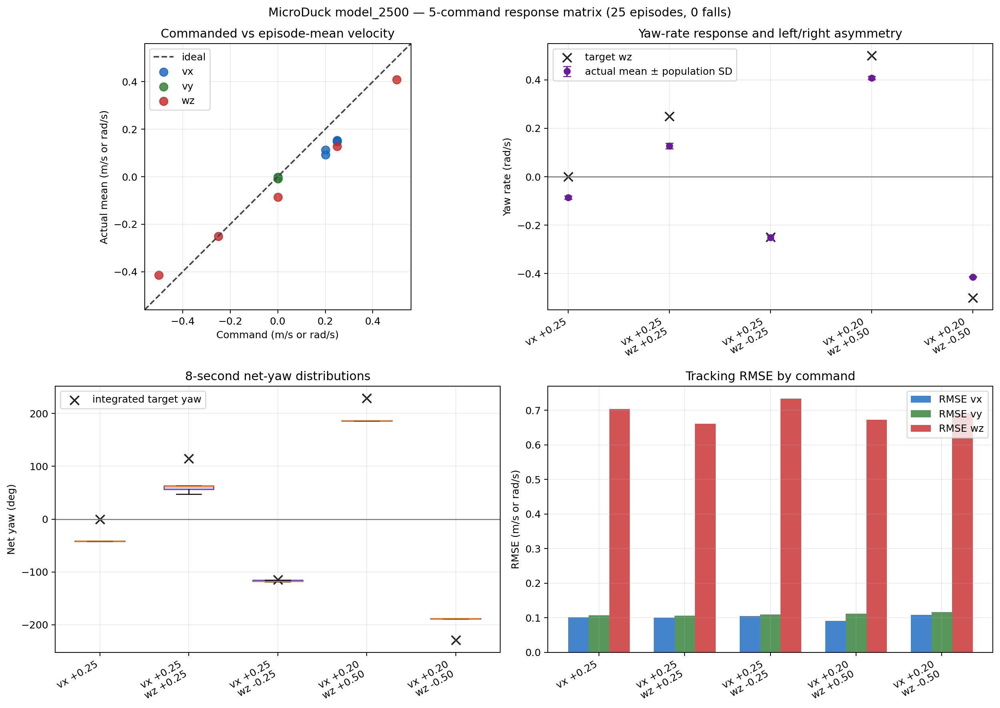

# PointGoal 行进转向门禁

日期：2026-09-15

## 目的

判断自训练候选能否满足 PointGoal 下层 locomotion 的两项核心需求：直行时
尽量保持航向，以及在已经行走的状态下响应左右转向。静止原地转向不作为本
协议的主要门禁。

当前先选择后期 checkpoint 中直行偏航相对较小的 `model_2500.onnx`。它在此前
10 秒 `vx=0.3` Gate 中的平均净偏航为 `-55.2 deg`，优于 `model_1999` 的
`-134.7 deg` 和 `model_2999` 的 `-73.0 deg`，但尚不能称为低偏航合格模型。

## 协议

- Checkpoint：`model_2500.onnx`；SHA256
  `db2e9964a65967662e1eabe519d825c51be6cdcb24954c4626661d992641713e`。
- 官方仓库 commit：`c5729fafecdba04e24912594d6a28e182d9e71b6`。
- Runtime：官方 MuJoCo 场景、BAM M6、ONNX CPU 推理，`61 obs -> 14 actions`。
- Reset：官方范围，配对 seeds `42--46`。
- 每个 Episode：1 秒零命令稳定，2 秒 `vx=0.25` 直行建立步态，再测试 8 秒。
- 测试命令：直行 `(vx=0.25, wz=0)`、缓转 `(0.25, ±0.25)`、正常转弯
  `(0.20, ±0.50)`。
- Episode 数：5 条命令 × 5 seeds = 25；不与其他评测协议合并。
- 本协议不加载 Reward Manager，因此没有训练 Reward 或 Episode Return。

命令定义见
[`pointgoal_moving_turn_5.json`](../../../evaluation/command_sets/pointgoal_moving_turn_5.json)。
原始 CSV 与运行汇总保存在本地 Git 忽略目录：
`artifacts/week03/03_pointgoal_moving_turn/model_2500/`。

## 结果

以下均为正式 8 秒测试段的五 Episode 均值：

| 指令 `vx / wz` | 实际 `vx` | 实际 `wz` | 净偏航 | Fall Rate |
| --- | ---: | ---: | ---: | ---: |
| `+0.25 / 0.00` | `+0.151` | `-0.086` | `-40.3 deg` | `0%` |
| `+0.25 / +0.25` | `+0.152` | `+0.127` | `+58.6 deg` | `0%` |
| `+0.25 / -0.25` | `+0.147` | `-0.251` | `-115.1 deg` | `0%` |
| `+0.20 / +0.50` | `+0.112` | `+0.408` | `+187.1 deg` | `0%` |
| `+0.20 / -0.50` | `+0.093` | `-0.414` | `-188.7 deg` | `0%` |

## 结论

`model_2500` 在保持正向移动的同时能按命令向左右两侧转弯，且 25 Episode 均
未跌倒。相对于直行时 `-0.086 rad/s` 的固有负偏航，四项转弯命令都引起了
方向正确的角速度变化：缓左/缓右分别为 `+0.213/-0.165 rad/s`，正常左/右
分别为 `+0.494/-0.328 rad/s`。这约为命令变化量的 `85%/66%/99%/66%`。
因此，此前纯 `wz` 指令下接近零响应不能代表它缺少 PointGoal 所需的行进
转向能力。

但该模型还不能直接冻结为最终导航策略：直行 8 秒仍累计约 `-40.3 deg`，
左右缓转明显不对称，且转弯时前进速度只有目标的约 47%--74%。更准确的阶段
判断是“具备双向行进转向能力，但存在持续右偏和速度欠跟踪”。下一步应把它
接入带航向反馈的 Classical PointGoal 闭环，测量到达率、路径效率和左右目标
对称性；原地转向只保留为辅助诊断。
