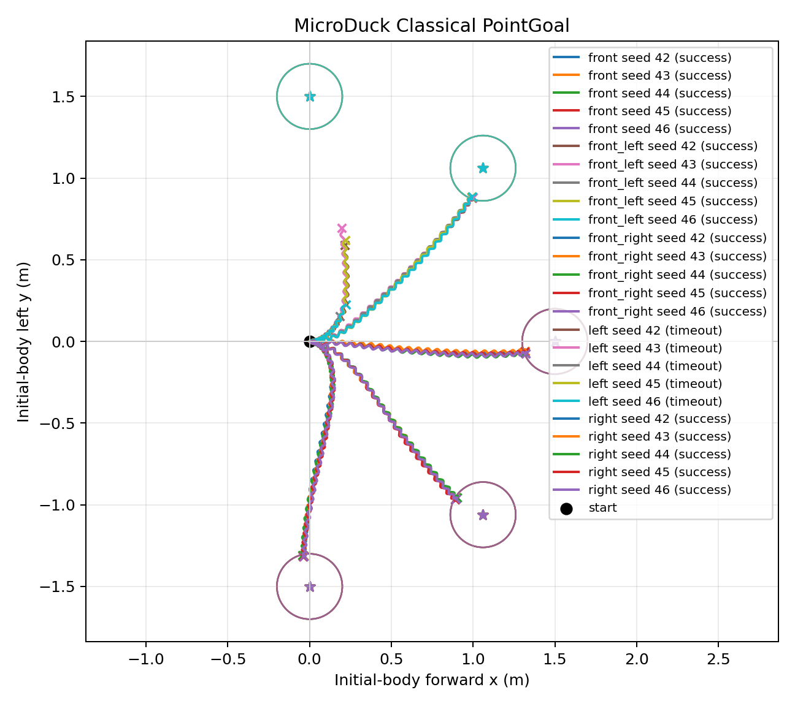

# model_2500 Classical PointGoal pilot

日期：2026-09-15

## 目的

在不调整 Controller 参数的前提下，检查 `model_2500.onnx` 的现有航向闭环
能否补偿直行右偏，以及 Locomotion 的左右响应不对称是否会转化为
PointGoal 到达失败。这是第三周的轻量诊断，不是第四周的正式
Classical Navigator Benchmark。

## 冻结协议

- Checkpoint：`model_2500.onnx`；SHA-256
  `db2e9964a65967662e1eabe519d825c51be6cdcb24954c4626661d992641713e`。
- 官方仓库 commit：`c5729fafecdba04e24912594d6a28e182d9e71b6`。
- Runtime：官方 MuJoCo、BAM M6、ONNX CPU，`61 obs -> 14 actions`，Locomotion
  `50 Hz`，Navigator `10 Hz`。
- 位姿：由 `MujocoBackend` 提供的仿真真值；未加定位噪声或延迟。
- Reset：`official_reset`，配对 seeds `42--46`。
- 目标：初始机体坐标下距离 `1.5 m` 的正前、左前、右前、左侧、右侧。
- 终止：进入 `0.2 m` 成功圈并保持 `0.5 s`，或 `20 s` 超时，或跌倒。
- Episode：5 类目标 x 5 seeds = `25`；不与行进转向的 25 Episode 合并。
- Controller：使用 smoke 后冻结的 Constrained Go-to-Goal 参数，本轮未调参。

协议原文见
[`pointgoal_pilot_5.json`](../../../evaluation/goal_sets/pointgoal_pilot_5.json)。完整汇总见
[`pointgoal_pilot_model_2500.json`](summaries/pointgoal_pilot_model_2500.json)；原始 50 Hz CSV
保存在 Git 忽略的
`artifacts/week03/04_classical_pointgoal_pilot/model_2500/raw/`。

## 结果

| 目标 | Success Rate | Timeout Rate | Fall Rate | 中位最终距离 | 成功 Episode 中位路径效率 | 成功 Episode 中位时间 |
| --- | ---: | ---: | ---: | ---: | ---: | ---: |
| 正前 | `100%` | `0%` | `0%` | `0.194 m` | `0.897` | `10.08 s` |
| 左前 | `100%` | `0%` | `0%` | `0.189 m` | `0.858` | `10.72 s` |
| 右前 | `100%` | `0%` | `0%` | `0.193 m` | `0.867` | `10.46 s` |
| 左侧 | `0%` | `100%` | `0%` | `0.935 m` | 不适用 | 不适用 |
| 右侧 | `100%` | `0%` | `0%` | `0.192 m` | `0.768` | `13.10 s` |
| **总体** | **`80%`** | **`20%`** | **`0%`** | **`0.193 m`** | **`0.863`** | 分类报告 |

## 左右对称性诊断

左前和右前均为 `5/5` 成功，最终距离和路径效率接近。但纯侧向目标出现
完全不对称：左侧 `0/5`，右侧 `5/5`，成功率镜像差为 `-100` 个百分点。

左侧 Episode 中，Controller 的 `wz` 限幅占比为 `80.5%--98.0%`。将五个
Episode 的测试帧汇总后，左侧平均命令/实测 `wz` 约为 `+0.47/+0.08 rad/s`；
镜像右侧约为 `-0.10/-0.12 rad/s`。这表明左侧失败时高层已经持续请求
正 yaw，但底层的平均正 yaw 响应明显不足。

## 结论与决策

`model_2500` 在 Nominal 条件下稳定且能完成正前、斜前和右侧目标，说明
现有闭环能补偿部分直行偏航。但左侧的稳定失败证实，它不具备可接受的
左右对称性，因此不能冻结为第四周的最终 Locomotion Policy。

本轮不根据结果追调 Controller。结合先前的行进转向证据，下一个单变量
训练应优先检查 yaw tracking Reward 的定义，让它直接区分“正确的 commanded
yaw 跟踪”与“静止或其他机身角速度”。在确认上游实现和唯一修改因素后，
再开始新模型训练。

本结果仅是使用仿真真值位姿、无延迟与 Nominal 物理参数的任务级诊断，不代表
Sim2Real 或真机鲁棒性验收。
