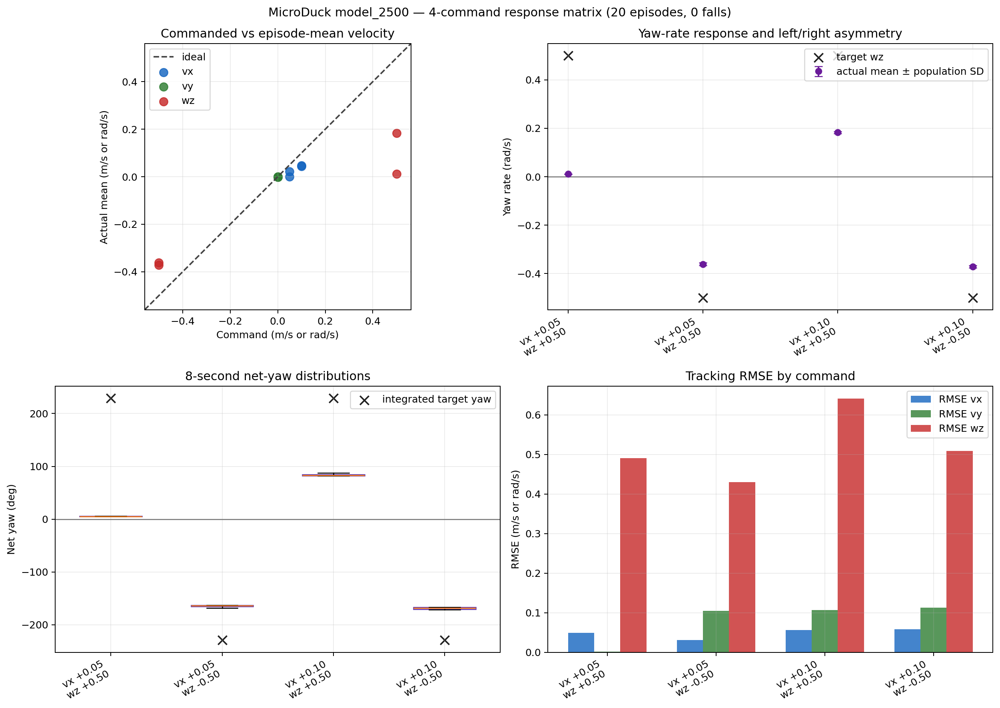

# model_2500 低速 yaw 归因评测

日期：2026-09-15

## 目的

正式 Classical PointGoal pilot 中，左侧目标 5 个 Episode 全部超时，而右侧
5 个 Episode 全部到达。轨迹显示左侧在开始时长时间保持低速，右侧则很快
建立转向并开始向目标前进。

本协议移除 PointGoal Controller 闭环，直接向 `model_2500.onnx` 发送对称的
低速 `vx + wz` 命令，判断启动差异是否来自底层 Locomotion Policy。

## 协议

- Checkpoint：`model_2500.onnx`；SHA-256
  `db2e9964a65967662e1eabe519d825c51be6cdcb24954c4626661d992641713e`。
- 官方仓库 commit：`c5729fafecdba04e24912594d6a28e182d9e71b6`。
- Runtime：官方 MuJoCo、BAM M6、ONNX CPU，`61 obs -> 14 actions`。
- Reset：`official_reset`，配对 seeds `42--46`。
- 每个 Episode：1 秒零命令稳定，然后直接测试 8 秒；不使用 gait lead-in。
- 命令：`vx=0.05/0.10 m/s` 与 `wz=±0.50 rad/s` 的 4 种组合。
- Episode 数：4 条命令 x 5 seeds = `20`；不与 PointGoal pilot 合并。
- Reward：ONNX 部署评测，不计算训练 Reward 或 Return。

命令定义见
[`pointgoal_low_speed_yaw_5.json`](../../../evaluation/command_sets/pointgoal_low_speed_yaw_5.json)。
关键汇总见
[`pointgoal_low_speed_yaw_5_model_2500.json`](summaries/pointgoal_low_speed_yaw_5_model_2500.json)。
原始 CSV 保存在 Git 忽略的
`artifacts/week03/05_pointgoal_low_speed_yaw/model_2500/`。

## 结果

以下数值均为五个 Episode 的均值；净偏航和速度只统计正式 8 秒测试段。

| 命令 `vx / wz` | 实测 `vx` | 实测 `wz` | 8秒净偏航 | yaw 幅值响应比 | Fall Rate |
| --- | ---: | ---: | ---: | ---: | ---: |
| `+0.05 / +0.50` | `+0.001` | `+0.011` | `+5.3 deg` | `2.3%` | `0%` |
| `+0.05 / -0.50` | `+0.022` | `-0.361` | `-164.7 deg` | `72.2%` | `0%` |
| `+0.10 / +0.50` | `+0.047` | `+0.183` | `+83.7 deg` | `36.5%` | `0%` |
| `+0.10 / -0.50` | `+0.043` | `-0.371` | `-169.0 deg` | `74.3%` | `0%` |

## 归因

在 `vx=0.05` 时，正 yaw 命令下的模型几乎不前进也不转向，而镜像负 yaw
命令下稳定达到约 `-0.36 rad/s`。将 `vx` 提高到 `0.10` 后，正 yaw 恢复到
约 `+0.18 rad/s`，但仍只有镜像负 yaw 响应的约一半。四组命令均无跌倒，
且组内 seed 标准差很小，该现象不是单一 reset 的偶然行为。

这与 PointGoal 轨迹一致：侧向目标初始航向误差约为 `±90 deg`，冻结 Controller
会先输出约 `vx=0.05` 和大幅 yaw。右转能迅速减少航向误差并解除前进限制；
左转则因为低速正 yaw 几乎无响应，长时间留在同一工况，形成启动死区。

本证据来自无 Navigator 的固定命令评测，因此可以将左右启动差异定位到底层
Locomotion Policy，而不是坐标系、目标判定或 Controller 左右符号错误。

## 决策

`model_2500` 不应冻结为最终导航底层。下一个 Candidate B 的唯一训练假设是：
将 angular tracking 从“yaw 误差与机身 xy 角速度的合成项”改为“只跟踪
commanded yaw rate 与实测 yaw-axis angular velocity 的误差”。

候选 B 应保持 `std=0.5`、Reward weight、command sampling、PPO 参数、seed 和 envs
不变，不同时加入 mirror loss。先实现 Reward 和单变量配置测试，然后依次运行
`64 envs x 5 iterations` 冒烟和 `64 envs x 25 iterations` 预运行；本评测不直接
授权开始 4096 envs 长训练。
