# Candidate B：yaw-only angular tracking

日期：2026-09-15—2026-09-17

## 决策依据

`model_2500` 的 25-Episode Classical PointGoal pilot 为 20/25 到达、0% 跌倒，
但左侧目标 0/5、右侧目标 5/5。随后 20-Episode 低速 yaw 归因显示：

- `vx=0.05, wz=+0.50` 的实际 `wz` 约为 `+0.011`，响应率约 2.3%；
- `vx=0.05, wz=-0.50` 的实际 `wz` 约为 `-0.361`，响应率约 72.2%；
- 提高到 `vx=0.10` 后正 yaw 响应有所恢复，但仍明显弱于负 yaw。

因此下一轮训练只验证一个假设：原 angular tracking 奖励把 yaw error 与机身
roll/pitch angular velocity 合并，会使行走中的横向角速度干扰期望的 yaw 跟踪；
将正奖励改为只度量 commanded yaw rate 与 body-frame yaw rate 的误差，是否能够
减轻低速正 yaw 启动死区和左右不对称。

## 唯一行为修改

Control（Candidate A）的 angular tracking error：

```text
e = (wz_cmd - wz_actual)^2 + wx_actual^2 + wy_actual^2
r = exp(-e / std^2)
```

Candidate B：

```text
e = (wz_cmd - wz_actual)^2
r = exp(-e / std^2)
```

保持不变：

- `std = sqrt(0.25) = 0.5`
- angular tracking reward weight
- command sampling 与 curriculum
- PPO 参数、seed 42、4096 envs 正式训练规模
- 从头训练，不从 Candidate A checkpoint 续训
- 不加入 mirror loss 或 controller 调参

roll/pitch angular velocity 仍由独立的 `body_ang_vel` penalty 约束。

## 官方仓库实现

- 仓库：`/home/elvars/projects/microduck_rl`
- 分支：`codex/yaw-only-angular-tracking`
- Task：`Mjlab-Velocity-Flat-Yaw-Only-Tracking-MicroDuck`
- Experiment：`velocity_yaw_only_tracking`
- Run：`yaw-only-tracking-seed42-from-scratch`
- 已保存 checkpoint：`0 / 250 / 500 / 750 / 1000 / 1250 / 1500 / 1750 / 1999`

实现新增 yaw-only reward callable，并基于 Candidate A 复制环境和 runner 配置；
仅替换 `track_angular_velocity.func`。独立 Task/Experiment/Run 名称用于避免与旧模型
日志混淆，不属于训练行为变化。

## 验证结果

### 单元与配置差异测试

```text
uv run --with pytest pytest -q \
  tests/test_velocity_angular_tracking_candidate.py \
  tests/test_velocity_yaw_only_tracking_candidate.py
```

结果：`5 passed`。

测试覆盖：

- 完美 yaw 跟踪时，即使 `wx/wy` 非零，yaw-only reward 仍为 1；
- yaw error 为 0.5、std 为 0.5 时，reward 为 `exp(-1)`；
- Candidate A 与 B 的环境配置只在 angular reward callable 上不同；
- Candidate B 继承 seed、PPO、save interval、max iterations 和禁用 symmetry 等设置。

### CUDA 冒烟与预运行

| 门禁 | 结果 | 本地日志 | W&B run |
|---|---|---|---|
| 64 envs × 5 iterations | 通过 | `logs/rsl_rl/velocity_yaw_only_tracking/2026-09-15_22-42-01_yaw-only-tracking-seed42-from-scratch` | `sn2sj9xq` |
| 64 envs × 25 iterations | 通过 | `logs/rsl_rl/velocity_yaw_only_tracking/2026-09-15_22-43-31_yaw-only-tracking-seed42-from-scratch` | `7wuldkwe` |

两次均使用 WSL2 CUDA、NVIDIA RTX 4060 Laptop GPU、BAM M6，actor observation
为 61 维、action 为 14 维。25-iteration 末轮：

- `nan_state = 0`
- Mean reward `0.55`
- Mean episode length `37.28`
- Mean action std `0.97`
- Mean value loss `0.0328`
- Mean surrogate loss `-0.0385`

`model_4.pt`、`model_24.pt` 和对应 ONNX 均已落盘。短预运行从随机初始化开始，
仍频繁跌倒是预期现象；这里的通过仅表示配置、CUDA、Reward 数值、训练与导出链路
没有明显异常，不表示策略已学会稳定行走。

## 正式训练

- Git commit：`062921c4c9f65107e391df042f8de424136213c3`
- Run：`2026-09-16_09-56-12_yaw-only-tracking-seed42-from-scratch`
- W&B run：`digk14w7`
- seed / envs / iterations：42 / 4096 / 2000
- wall-clock：约 1 h 47 min
- observation / action：61 / 14
- resume：false
- symmetry：disabled

训练目录：

```text
/home/elvars/projects/microduck_rl/logs/rsl_rl/velocity_yaw_only_tracking/
2026-09-16_09-56-12_yaw-only-tracking-seed42-from-scratch/
```

已保存 `model_0/250/500/750/1000/1250/1500/1750/1999.pt`、最终 ONNX、
TensorBoard event 和完整环境/agent 配置。

关键 SHA-256：

```text
model_1999.pt
f6a32a64a606699fa98277d869dca94e0774bfba7484a50a47225bf428e41bfd

2026-09-16_09-56-12_yaw-only-tracking-seed42-from-scratch.onnx
83fbce03fc0b166025c44f5fdf701fdeb6fcfe70f525b09b38a5aa23131adae0

TensorBoard event
331f10b9e630de5ec6e478b73099e4d06cbef7b626891bc94f088e79d267e6c7
```

## 训练曲线对比口径

Control 为 Candidate A。其实际训练谱系按以下顺序合并：

1. `0–749`：`2026-09-14_20-50-41_angular-std025-seed42-from-scratch`
2. `750–1999`：`2026-09-14_22-04-10_angular-std025-seed42-resume-750-to-2000`

续训 event 覆盖重复 iteration。下表为每个 checkpoint 结束前 100 iterations 的
均值，不使用单个末轮值。Candidate A 在 iteration 750 附近因续训重启统计 buffer
出现曲线跳变，不解释为策略瞬间提升。

### Yaw error 与 angular reward

| Iteration | A yaw error ↓ | B yaw error ↓ | A angular reward | B angular reward |
|---:|---:|---:|---:|---:|
| 250 | 3.134 | 2.385 | 0.039 | 0.465 |
| 500 | 3.173 | 2.196 | 0.047 | 0.550 |
| 750 | 2.695 | 1.709 | 0.071 | 0.690 |
| 1000 | 2.291 | 1.348 | 0.109 | 0.877 |
| 1250 | 1.970 | 1.162 | 0.157 | 0.982 |
| 1500 | 1.701 | 1.059 | 0.202 | 1.053 |
| 1750 | 1.534 | 1.023 | 0.271 | 1.062 |
| 1999 | 1.414 | 1.011 | 0.323 | 1.072 |

Candidate B 的 `error_vel_yaw` 在全部同预算 checkpoint 窗口都低于 Candidate A，
并在约 1400 iterations 后进入接近 1.0 的平台。最后 100 iterations：

- yaw error：`1.414 → 1.011`，降低 28.5%；
- angular reward：`0.323 → 1.072`，提高 232%；
- 即使与 Candidate A 的额外续训 `model_2999` 比，B@1999 的 yaw error 仍比
  A@2999 的 1.315 低约 23.1%，但两者训练预算不同。

`error_vel_yaw` 定义未改变，可以跨候选比较。angular reward 删除了 `wx/wy`
error，数值天然会升高，因此不能把 232% 直接解释为部署转向能力提高 232%；
总 Reward 也有相同口径限制。

### 末段完整指标

| 指标（最后 100 iterations 均值） | Candidate A | Candidate B | 变化 |
|---|---:|---:|---:|
| `error_vel_yaw` ↓ | 1.414 | 1.011 | -28.5% |
| `track_angular_velocity` ↑ | 0.323 | 1.072 | +231.9%* |
| `error_vel_xy` ↓ | 0.4156 | 0.4166 | +0.2% |
| Mean training reward | 109.65 | 117.60 | +7.3%* |
| Mean episode length ↑ | 954.05 | 933.45 | -2.2% |
| `fell_over` ↓ | 0.4008 | 0.5888 | +46.9% |
| `nan_state` | 0 | 0 | 无异常 |
| Mean action std | 0.1873 | 0.2007 | +7.1% |

`*`：Reward 定义不同，不作为等口径效果量。

`error_vel_xy` 基本持平，但 B 的末段 `fell_over` 高于 A、episode length 略低。
该 termination 统计不能直接换算成部署 Fall Rate，却是快筛必须核对的风险信号。

## ONNX 行进转向快筛

导出 `500 / 1000 / 1250 / 1500 / 1750 / 1999` 六个 ONNX，统一运行：

- 1 秒零命令稳定；
- 2 秒 `vx=0.25` 建立步态；
- 8 秒正式测试；
- 直行、缓慢左右转、正常左右转共 5 条命令；
- 每条 seeds 42–46，共 `6 × 5 × 5 = 150 Episode`；
- 官方 MuJoCo + BAM M6 + ONNX CPU，不计算训练 Reward。

全部 150 Episode 均未跌倒。关键结果：

| Checkpoint | 直行净偏航 | 缓转实际 `wz` 左/右 | 正常转向实际 `wz` 左/右 | 缓转镜像残差 | 正常镜像残差 |
|---:|---:|---:|---:|---:|---:|
| 500 | -38.6° | +0.128 / -0.293 | +0.350 / -0.509 | 0.165 | 0.159 |
| 1000 | -11.7° | +0.204 / -0.265 | +0.439 / -0.491 | 0.060 | 0.052 |
| 1250 | +22.9° | +0.272 / -0.206 | +0.539 / -0.444 | 0.066 | 0.094 |
| 1500 | -19.4° | +0.190 / -0.248 | +0.481 / -0.459 | 0.058 | 0.023 |
| **1750** | **-8.2°** | **+0.241 / -0.232** | **+0.510 / -0.511** | **0.010** | **0.004** |
| 1999 | -19.6° | +0.228 / -0.250 | +0.475 / -0.543 | 0.021 | 0.068 |

`model_1750` 是唯一同时取得较小直行偏航、缓转对称和正常转向对称的 checkpoint；
`model_1999` 的负 yaw 已出现过冲，因此不按“越晚越好”选择最终 checkpoint。

与 Candidate A `model_2500` 的同协议结果对比：

| 指标 | A `model_2500` | B `model_1750` | 解释 |
|---|---:|---:|---|
| 直行 8 秒净偏航 | -40.3° | -8.2° | 偏航绝对值减少约 79.6% |
| 直行实际 `vx` | 0.151 | 0.117 | 前进欠跟踪进一步加重 |
| 缓转实际 `wz` 左/右 | +0.127 / -0.251 | +0.241 / -0.232 | 左右响应基本镜像 |
| 正常转向实际 `wz` 左/右 | +0.408 / -0.414 | +0.510 / -0.511 | 基本镜像，略有过冲 |
| Fall Rate | 0% | 0% | 本协议稳定性未退化 |

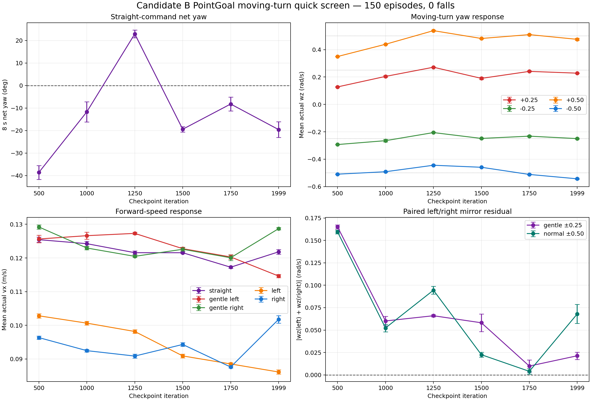

## `model_1750` 低速 yaw 快筛

对入围的 `model_1750` 继续运行无 gait lead-in 的 20-Episode 低速协议：

| 命令 `vx / wz` | 实测 `vx` | 实测 `wz` | 8 秒净偏航 | yaw 幅值响应比 | Fall Rate |
|---|---:|---:|---:|---:|---:|
| `+0.05 / +0.50` | -0.000 | +0.022 | +10.5° | 4.5% | 0% |
| `+0.05 / -0.50` | +0.016 | -0.489 | -225.5° | 97.9% | 0% |
| `+0.10 / +0.50` | +0.034 | +0.455 | +208.5° | 91.0% | 0% |
| `+0.10 / -0.50` | +0.041 | -0.505 | -231.8° | 101.0% | 0% |

相对 Candidate A `model_2500`，`vx=0.10` 的正 yaw 响应从 36.5% 提升到 91.0%，
说明 yaw-only Reward 确实扩大了可响应区域；但 `vx=0.05` 的正 yaw 仍只有 4.5%，
与负 yaw 的 97.9% 差距极大。原来的低速正 yaw 启动死区被缩小，但没有消失。

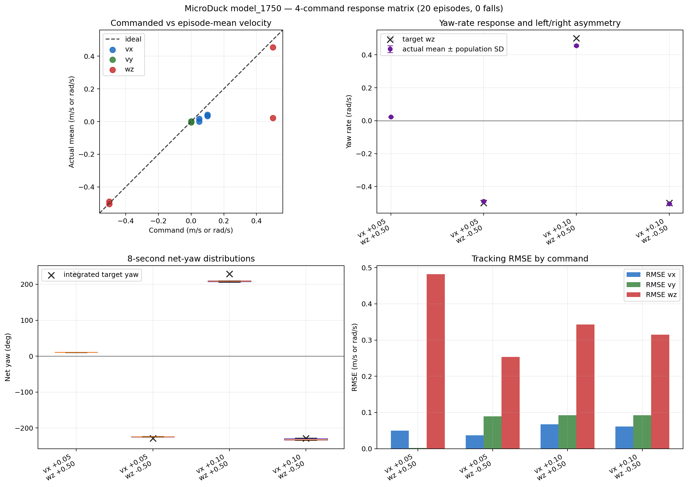

## `model_1750` 原地转向辅助诊断

为区分“`vx=0.05` 与 yaw 的组合覆盖不足”和“从静止状态启动转向整体未学会”，
使用与低速 yaw 协议相同的 1 秒稳定、8 秒测试和 seeds 42–46，只将
`vx` 改为 0，完成左右各 5 Episode：

| 命令 `vx / wz` | 实测 `vx` | 实测 `wz` | 8 秒净偏航 | yaw 幅值响应比 | Fall Rate |
|---|---:|---:|---:|---:|---:|
| `0.00 / +0.50` | -0.000 | +0.0195 | +9.2° | 3.9% | 0% |
| `0.00 / -0.50` | -0.000 | -0.0156 | -7.6° | 3.1% | 0% |

10/10 均未跌倒，但两个方向都几乎站立不动。这排除了“策略已学会从静止
原地转向，只因 `vx=0.05` 组合稀疏而失败”这一较强解释。训练采样器已为 15%
环境显式生成 `vx=vy=0, |wz|∈[0.4,1.0]` 的左右对称命令，但该能力仍未学成。
因此 command sampling 覆盖不足可能影响低速联合命令，却不是唯一根因。

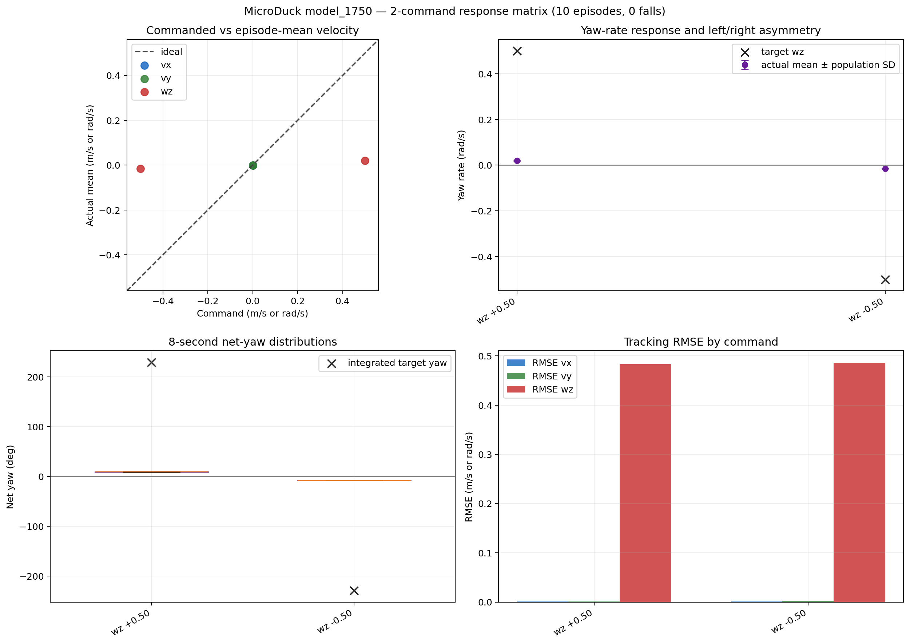

## 启动历史与 checkpoint 突变检查

为确认“从静止启动失败”是整个训练过程都存在，还是后期策略退化，对六个
checkpoint 使用同一套 1 秒零命令稳定、8 秒 `wz=±0.50`、seeds 42–46 协议。
成功定义仅用于本次辅助诊断：yaw 符号正确且 Episode 平均 `|wz|≥0.25 rad/s`。

| checkpoint | `+0.50` 实测 `wz` / 成功数 | `-0.50` 实测 `wz` / 成功数 | Fall |
|---:|---:|---:|---:|
| 500 | +0.417 / 5/5 | -0.528 / 5/5 | 0/10 |
| 1000 | +0.512 / 5/5 | -0.565 / 5/5 | 0/10 |
| 1250 | +0.607 / 5/5 | -0.444 / 5/5 | 0/10 |
| 1500 | +0.524 / 5/5 | -0.517 / 5/5 | 0/10 |
| 1750 | +0.020 / 0/5 | -0.016 / 0/5 | 0/10 |
| 1999 | +0.015 / 0/5 | -0.012 / 0/5 | 0/10 |

结果不是“原地转向从未学会”，而是在 `1500→1750` 之间发生了突变。为检查
reset 后是否已经存在可转向状态，又对 `model_1750` 取消 1 秒零命令预热：

| 命令 `vx / wz` | reset 后立即下命令 | 静止 1 秒后下命令 |
|---|---:|---:|
| `0.00 / +0.50` | 3/5 成功 | 0/5 成功 |
| `0.00 / -0.50` | 3/5 成功 | 0/5 成功 |
| `0.05 / +0.50` | 4/5 成功 | 0/5 成功 |
| `0.05 / -0.50` | 5/5 成功 | 5/5 成功 |

这说明 `model_1750` 的失败强烈依赖状态历史：部分 reset 状态可以直接进入转向
步态，但先执行 1 秒零命令后会落入难以离开的站立吸引域。它解释了 PointGoal
左侧目标中“先停住、再很晚启动”的轨迹，也说明只看 reset 后立即施加命令会
高估可用性。

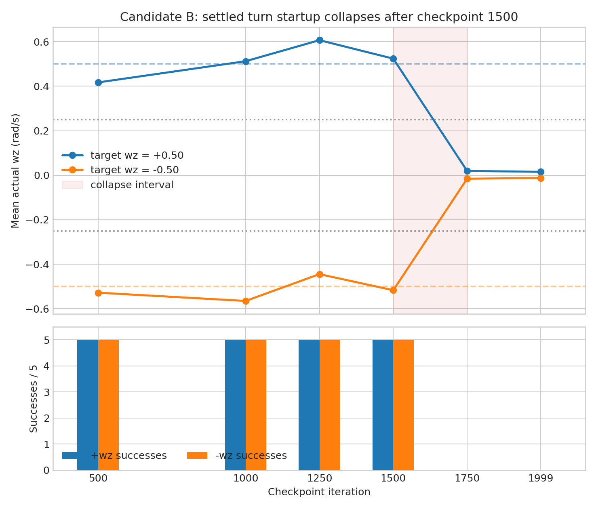

## 官方 Reward Manager 归因

使用 PT checkpoint 和官方 Reward Manager 复测相同命令；这里的 Return 只累计
8 秒测试段，1 秒零命令预热不计入。原地转向的关键结果为：

| checkpoint / 启动方式 | 命令 `wz` | 实测 `wz` | Return | angular tracking | air time | action rate |
|---|---:|---:|---:|---:|---:|---:|
| 1500 / 静止 1 秒 | +0.50 | +0.495 | 73.709 | 14.867 | 8.964 | -0.468 |
| 1500 / 静止 1 秒 | -0.50 | -0.470 | 73.469 | 14.502 | 9.288 | -0.510 |
| 1750 / reset 后立即 | +0.50 | +0.472 | 72.908 | 14.385 | 8.568 | -0.467 |
| 1750 / reset 后立即 | -0.50 | -0.475 | 73.812 | 14.494 | 9.192 | -0.438 |
| 1750 / 静止 1 秒 | +0.50 | +0.104 | 61.914 | 7.779 | 1.560 | -0.093 |
| 1750 / 静止 1 秒 | -0.50 | -0.193 | 64.864 | 9.420 | 3.528 | -0.169 |

静止后失败主要损失来自 angular tracking 和 air time；不动作虽能获得更高的
linear tracking、upright，并减小 action-rate penalty，但总 Return 仍比正确转向
低约 9～12。进一步核对上游 Reward 实现后，`air_time`、`feet_clearance`、
`feet_swing_height`、`foot_slip` 和 `variable_posture` 都用
`norm(linear command)+abs(wz)` 判断运动命令，纯 yaw 不会错误地关闭步态 Reward。
因此未发现“原地转向 Reward 根本没激活”的实现错误，更符合后期训练形成局部
站立吸引域的解释。

重新从同一 `model_1750.pt` 导出 ONNX 后，与现有 ONNX 对 100 组随机 61 维
Observation 的 14 维 Action 逐项完全一致，最大绝对差为 0；错误 checkpoint、
Observation 合约或导出模型不一致也可排除。官方 Warp 与原生 MuJoCo 的绝对
响应幅度不同，但都复现了“立即命令明显好于静止后命令”的排序。

`model_1500` 和 `model_1750` 在评测时都已恢复最终 Reward 权重，所以不能把
失败解释为评测阶段权重不同。不过训练在 1500 附近同时改变了 action-rate 权重、
standing fraction、head-pose 范围与 bias、CoM 范围等多个 curriculum 项；本轮只能
将问题定位到这段后期训练和状态转换，不能仅凭相关性断言 action-rate 是唯一原因。

## `model_1500 / 1750` Classical PointGoal pilot

使用与 Candidate A `model_2500` 完全相同且已冻结的 Controller、5 组目标、
seeds 42–46、20 秒 timeout 和 0.2 m 到达半径，分别对 `model_1750` 和
`model_1500` 完成 `5 × 5 = 25 Episode` 复测。两轮都只替换底层 ONNX，
不调整 Controller 参数。

| 指标 | A `model_2500` | B `model_1500` | B `model_1750` |
|---|---:|---:|---:|
| Success Rate | 80%（20/25） | **100%（25/25）** | 80%（20/25） |
| Fall Rate | 0% | 0% | 0% |
| Timeout Rate | 20% | **0%** | 20% |
| 成功 Episode 中位 Path Efficiency | **0.863** | 0.806 | 0.824 |
| 全部 Episode 中位 Progress Efficiency | **0.752** | 0.706 | 0.717 |
| 全部 Episode 中位 Final Distance | 0.193 m | **0.188 m** | 0.195 m |

分目标对比：

| 目标 | A `2500` 成功数 / 时间 | B `1500` 成功数 / 时间 | B `1750` 成功数 / 时间 |
|---|---:|---:|---:|
| 正前 | 5/5 / 10.08 s | 5/5 / 12.02 s | 5/5 / 12.70 s |
| 左前 | 5/5 / 10.72 s | 5/5 / 12.34 s | 5/5 / 12.98 s |
| 右前 | 5/5 / 10.46 s | 5/5 / 12.36 s | 5/5 / 12.84 s |
| 左侧 | 0/5 / — | **5/5 / 13.78 s** | 0/5 / — |
| 右侧 | 5/5 / 13.10 s | 5/5 / 14.02 s | 5/5 / 14.84 s |

两者都只在左侧目标失败，但失败程度不同。Candidate A 的左侧中位 Final Distance
为 0.935 m、Progress Efficiency 为 0.522；Candidate B 分别退化到 1.498 m 和
0.089，5 个 Episode 几乎停留在起点，同时 `wz` 命令约 98% 时间处于限幅。
这与低速快筛中 `vx=0.05,wz=+0.50` 仅有 4.5% yaw 响应相互印证：
建立步态以后更对称，并不等于能从静止状态执行左侧目标所需的低速正 yaw 启动。

`model_1500` 将此前两个模型都失败的左侧目标从 0/5 提升到 5/5，左右侧目标
均为 5/5，说明静止后双向转向能力确实转化成了任务层收益。它在其余四组目标也
全部到达，且完成时间均比 `model_1750` 更短。不过 `model_1500` 的路径效率和
进展效率仍低于 Candidate A，所有共有成功目标的完成时间也更长，符合前进速度
欠跟踪的结果。

因此 checkpoint 选择结论需要修正：`model_1750` 是 seed 42 建立步态后行进转向
指标最好的 checkpoint，但 `model_1500` 才是本轮 25-Episode PointGoal pilot
表现最好的 checkpoint。后续 seed 43 已复现 `model_1500` 的 25/25，并再次观察到
1500 后的质量退化；这使 `model_1500` 成为跨两个 training seeds 的推荐早停点，
但还不能跳过扩展 Nominal 与 OOD 鲁棒性评测而直接冻结。

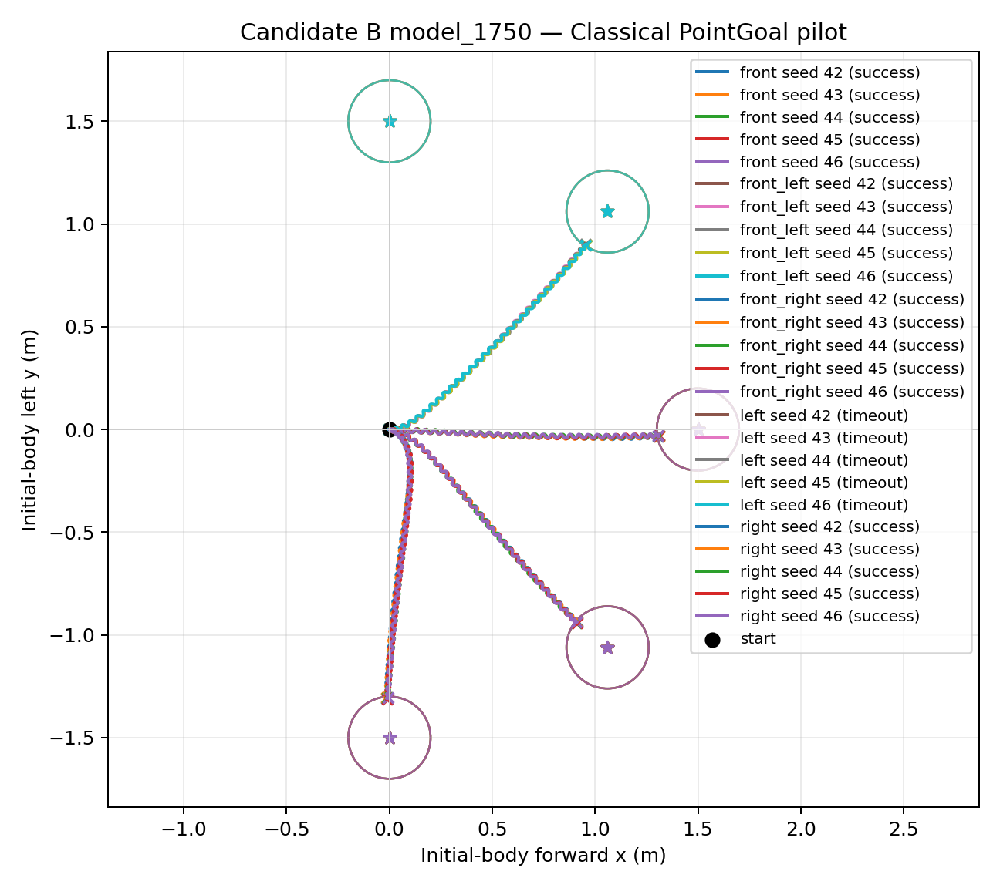

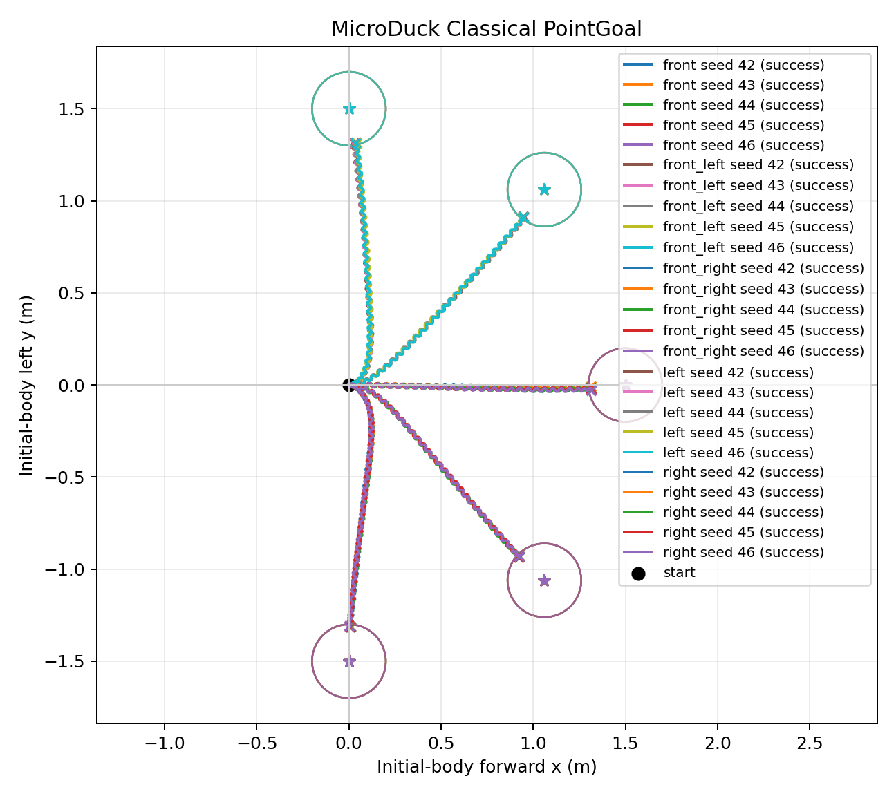

## `model_1500` 独立 Nominal holdout

在训练新 seed 前，固定 seed 42 的 `model_1500.onnx` 与原 Controller，使用未参与
checkpoint 选择的 reset seeds 100–104，以及
`1.0 / 1.8 m × 0° / ±30° / ±60° / ±90°` 的 14 个新目标，一次性运行
70 Episode。运行前已在 goal set 中冻结门槛，运行中未调整任何参数。

| 预设验收项 | 门槛 | 结果 | 判定 |
|---|---:|---:|---:|
| 总体 Success Rate | ≥95% | **100%（70/70）** | 通过 |
| 最低逐目标 Success Rate | ≥80% | **100%（14/14 目标均 5/5）** | 通过 |
| Fall Rate | 0% | **0%** | 通过 |
| Timeout Rate | ≤5% | **0%** | 通过 |
| 最大左右镜像成功率差 | ≤20 个百分点 | **0 个百分点** | 通过 |

按距离和绝对目标角度汇总：

| 分组 | Episode | 成功数 | 中位完成时间 | 中位 Path Efficiency |
|---|---:|---:|---:|---:|
| 1.0 m | 35 | 35 | 8.58 s | 0.813 |
| 1.8 m | 35 | 35 | 15.34 s | 0.780 |
| 0° | 10 | 10 | 11.11 s | 0.842 |
| ±30° | 20 | 20 | 11.25 s | 0.831 |
| ±60° | 20 | 20 | 11.97 s | 0.794 |
| ±90° | 20 | 20 | 13.02 s | 0.752 |

随着距离和转向角增大，完成时间上升、路径效率下降，但最难的 1.8 m、±90°
仍全部在 20 秒内到达，左右各 5/5。总体中位 Final Distance 为 0.189 m，
中位 Path Efficiency 为 0.803。该结果确认这个固定 ONNX 在已测 Nominal 范围内
具有稳定、对称的 PointGoal 能力；它仍不代表 training-seed 可复现性、OOD
鲁棒性或 Sim2Real readiness。

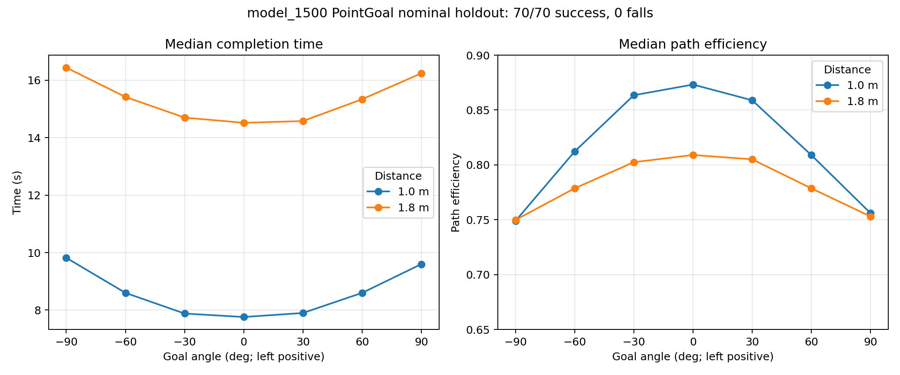

## seed 43 复现与续训退化检查

固定 Candidate B 的 Task、Reward、curriculum、command sampling、PPO、4096 envs
和从头训练设置，只把 training seed 从 42 改为 43。seed 43 先训练到
`model_1500.pt`，通过同一套轻量 Gate 与 PointGoal pilot 后，再保持配置不变续训到
`model_1999.pt`。所有部署评测仍固定使用 evaluation seeds 42–46；它们不属于
training seed。

训练曲线使用每个 checkpoint 截止前 100 iterations 的均值。seed 43 的续训日志与
初始日志按 iteration 合并，重叠点以后一次运行覆盖：

| Checkpoint | seed 42 `error_vel_yaw` | seed 43 `error_vel_yaw` | seed 42 angular reward | seed 43 angular reward | seed 42 / 43 Mean Reward |
|---:|---:|---:|---:|---:|---:|
| 1500 | 1.059 | 1.086 | 1.053 | 1.020 | 123.91 / 121.49 |
| 1750 | 1.023 | 1.013 | 1.062 | 1.079 | 116.54 / 118.00 |
| 1999 | 1.011 | 1.019 | 1.072 | 1.068 | 117.60 / 117.94 |

两条曲线的量级和走向基本一致：yaw error 在 1500 后仍小幅下降，angular reward
小幅上升，而 Mean Reward 都从 1500 的局部高点回落。因此训练标量没有把后续行为
退化清楚地暴露出来，checkpoint 仍必须经过行为 Gate 和 PointGoal 闭环评测。seed 43
在 1500 附近的尖锐短暂下探与续训进程切换边界重合，按 restart transient 处理，不把
它本身当作行为崩塌证据；续训 checkpoint 的结论来自重新导出的 ONNX 行为评测。

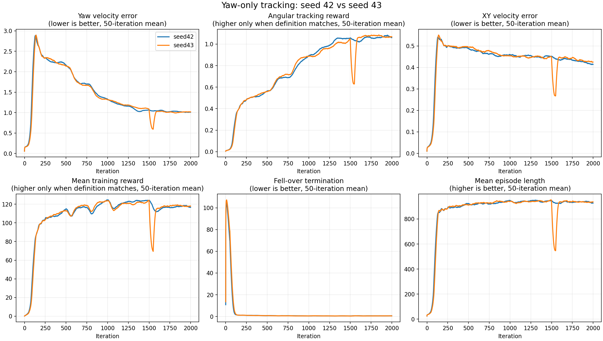

`model_1500` 的同协议对比如下：

| 指标 | seed 42 | seed 43 | 结论 |
|---|---:|---:|---|
| 静止后左转 `wz` | +0.524（5/5） | +0.492（5/5） | 均通过 |
| 静止后右转 `wz` | -0.517（5/5） | -0.518（5/5） | 均通过 |
| 直行实际 `vx` | 0.122 | 0.116 | seed 43 略低 |
| 直行净偏航 | -19.4° | +18.1° | 幅度接近、偏航方向随 seed 改变 |
| gentle turn mirror residual | 0.058 | 0.108 | seed 43 对称性较差 |
| normal turn mirror residual | 0.023 | 0.060 | seed 43 对称性较差 |
| PointGoal Success | 25/25 | 25/25 | 任务成功率复现 |
| PointGoal 中位 Final Distance | 0.188 m | 0.185 m | 接近 |
| PointGoal 中位 Path Efficiency | 0.806 | 0.769 | seed 43 低 0.038 |
| Fall / Timeout | 0 / 0 | 0 / 0 | 均稳定 |

seed 43 的五类目标中位完成时间为 `12.48 / 12.92 / 13.06 / 14.58 / 14.62 s`，
比 seed 42 对应的 `12.02 / 12.34 / 12.36 / 13.78 / 14.02 s` 全部更慢，但仍在
冻结的 20 秒超时内完成。也就是说，`model_1500` 的“能到达、双向可转、无跌倒”
已经在第二个 training seed 上复现，效率和直行偏航方向则不是 seed 不变性质。

继续训练后的行为退化也在 seed 43 上出现，但时点和方向不同：

| Training seed | `model_1750` | `model_1999` | 退化形态 |
|---:|---|---|---|
| 42 | 原地左右转均降至约 `|wz|=0.02`；PointGoal 20/25，左侧 0/5 | 原地左右仍几乎不转 | 1500–1750 间双侧启动崩塌 |
| 43 | 原地左右仍为 `+0.467/-0.454`；PointGoal 25/25，但 Path Efficiency 从 0.769 降至 0.718 | 左转仍为 `+0.446`，右转降至 `-0.019` | 先整体变慢，1750–1999 间右侧启动崩塌 |

seed 43 的 `model_1750` 虽仍 25/25，但直行实际 `vx` 从 0.116 降至 0.096，五类
目标中位完成时间延长到 `15.66 / 15.96 / 16.06 / 17.68 / 17.80 s`。因此不能只按
Success Rate 判断“没有退化”。两个 training seeds 都支持“1500 后存在性能回退”与
“`model_1500` 是当前合适早停点”，但不支持“必定在 1750、必定先坏同一侧”的更强
结论。当前证据把问题定位到 1500 后训练阶段；由于该阶段有多项 curriculum 同时变化，
仍不能把因果单独归给某一个 curriculum 权重。

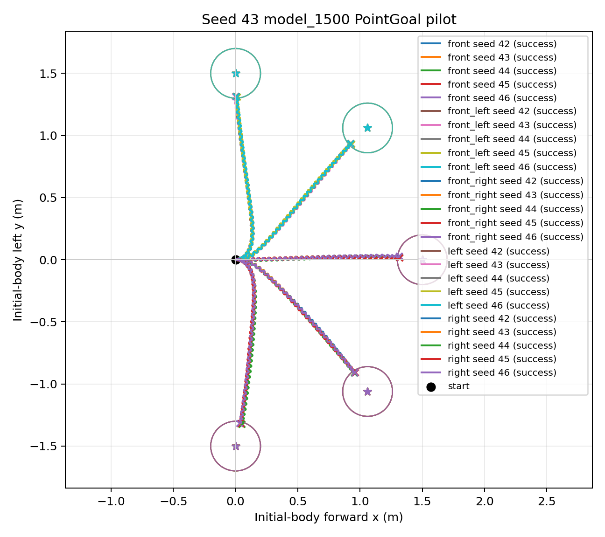

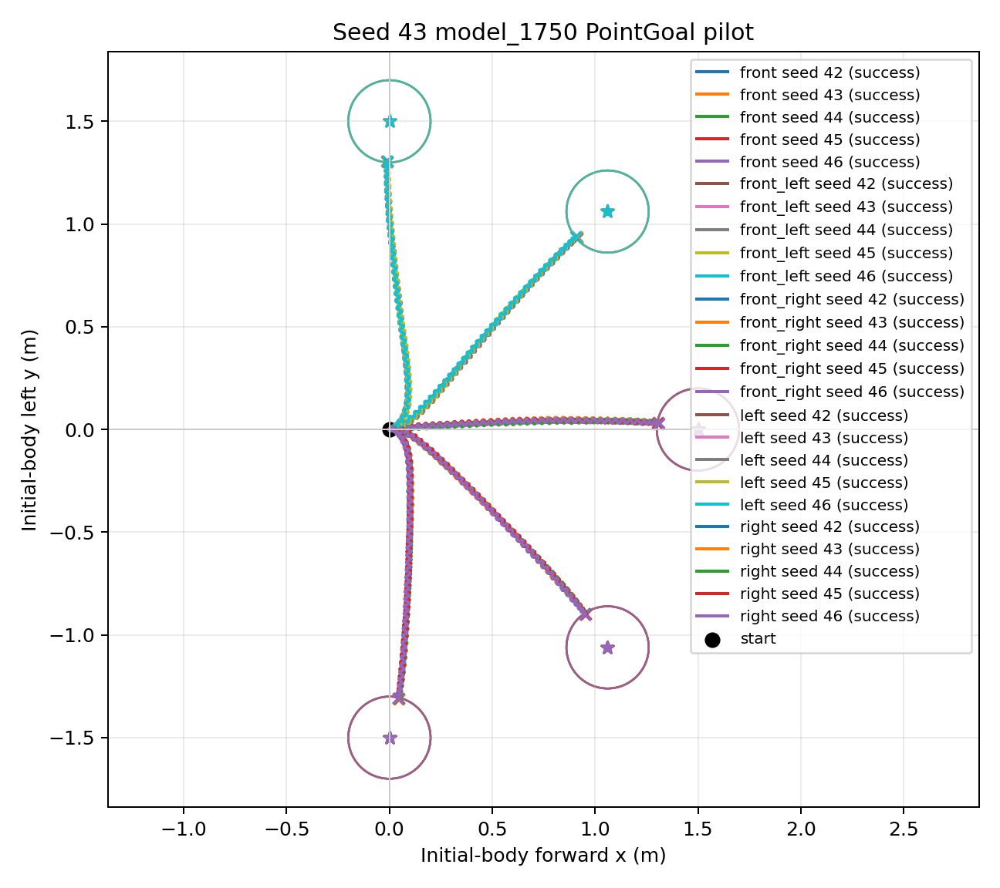

## seed 42 `model_1500` 400-Episode 随机速度检测

在进入 OOD 前，固定 seed 42 的 `model_1500.onnx`，运行与第二周 baseline 完全
相同的随机速度协议：reset seeds 42–441、command seed 20260911、1 秒零命令
预热和 10 秒测试。400 Episode 由 100 个 standing、60 个 turn-in-place 和
240 个三轴 general commands 组成；未修改模型、Controller 或成功门槛。

数据完整性检查通过：400 个 summary、400 个原始 CSV、220000 行、每行 95 字段，
没有缺失文件、行数错误或非有限数值。全部 400 Episode 均未跌倒。

预先冻结的 Nominal Success 要求 `vx/vy/wz` 每一轴的逐步速度 RMSE 都不超过
`max(命令幅值的 30%, 绝对下限)`。结果如下：

| 指标 | 第二周 `model_5999` baseline | seed 42 `model_1500` |
|---|---:|---:|
| Fall Rate | 0.0% | 0.0% |
| 运动指令严格 Nominal Success | 0.0% | 0.0% |
| 全部严格 Nominal Success | 25.0% | 0.0% |
| `vx` RMSE 单轴通过率 | 44.2% | 48.0% |
| `vy` RMSE 单轴通过率 | 32.2% | 0.0% |
| `wz` RMSE 单轴通过率 | 26.8% | 4.2% |
| `vx` Episode-mean slope / MAE | 0.517 / 0.063 | 0.521 / 0.062 |
| `vy` Episode-mean slope / MAE | 0.218 / 0.067 | 0.170 / 0.071 |
| `wz` Episode-mean slope / MAE | 0.801 / 0.146 | **1.040 / 0.078** |
| 原地正/负 yaw 实际均值 | +0.518 / -0.290 | **+0.742 / -0.740** |

Candidate B 的 yaw Episode 均值响应明显优于 baseline，正负原地转向也接近对称；
这与 25-Episode PointGoal pilot 的双向转向改善一致。但它仍不通过严格随机速度
Gate，主要暴露三类限制：

1. `vx` 响应斜率仍只有约 0.52，前进速度持续欠跟踪。
2. `vy` 响应斜率只有 0.17，完整三轴 locomotion 能力没有建立。
3. 即使 Episode 均值 yaw 接近命令，逐步 `wz` RMSE 仍大，说明步态内角速度振荡
   明显。100 个 standing 也全部未通过严格 RMSE：平均后退约 0.07 m/10 s，平均
   净偏航约 +21.4°/10 s，停止状态并不真正静止。

为区分“均值偏置”和“步态内振荡”，报告补充了非 Gate 的 Episode-mean 诊断：
全部 Episode 的三轴均值通过率为 40.8%，只看当前 PointGoal 接口的 `vx/wz` 为
50.0%；300 个运动指令对应为 21.0% 和 33.3%。这些结果只能帮助归因，不能在看到
结果后替代预先冻结的 RMSE Gate。

该协议覆盖正负 `vx`、非零 `vy` 和全范围 `wz`，而当前 Classical PointGoal
Navigator 固定为 `[vx, 0, wz]`。因此“完整三轴严格 Success 为 0”不能改写已经完成
的 70/70 PointGoal Nominal holdout，但它明确说明：`model_1500` 不能宣称具备完整
随机速度跟踪能力，并且进入 OOD 前必须显式决定是否接受 `vy` 为任务外能力，同时把
停止漂移、`vx` 欠跟踪和 yaw 振荡作为当前任务内的已知风险。

详细报告与图表见 [400-Episode 随机速度检测](random_velocity_400/README.md)。

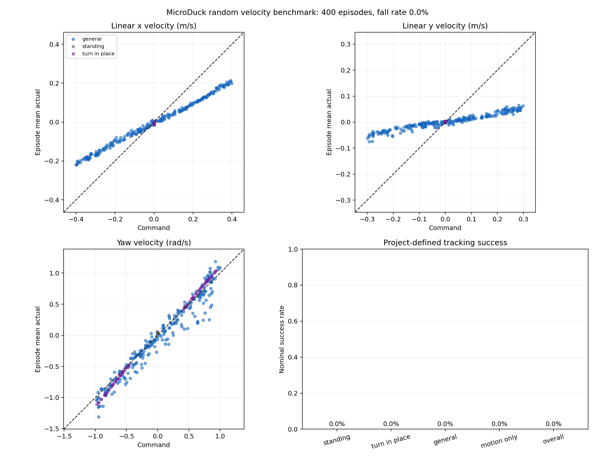

## 当前结论

1. yaw-only error 使定义未变的 `error_vel_yaw` 在整个同预算训练过程中持续改善，
   训练假设得到初步支持。
2. 较高的 angular reward 部分来自数学定义变化，不能单独证明实际转向更好。
3. seed 42 与 seed 43 的 `model_1500` 均保留静止后双向启动能力，PointGoal 合计
   50/50、0 跌倒、0 超时；Candidate B 的早期任务能力已获得两次独立训练复现。
4. seed 43 的 Path Efficiency 和完成时间弱于 seed 42；直行偏航方向也相反。
   training seed 会影响质量与偏置，不能把单个 seed 的精确数值当成固定模型性质。
5. 独立 Nominal holdout 使用全新 seeds 与目标得到 70/70、0 跌倒、0 超时，
   所有预设 Gate 均通过；固定 `model_1500.onnx` 的 Nominal 能力得到确认。
6. 两个 seed 都在 1500 后出现退化，但 seed 42 是较早的双侧启动崩塌，seed 43
   是先变慢、后在 1999 出现单侧崩塌。当前应采用 `model_1500` 早停，并保留
   行为 Gate 选 checkpoint，不能只看训练 Reward。
7. 加上 seed 43 与本次随机速度检测，本报告覆盖的 900 个部署 Episode 合计 0 跌倒；
   另有 50 个官方 PT Reward Episode 用于归因。该安全性统计不等同于任务成功率。
8. 400-Episode 严格三轴 Nominal Success 为 0%，因此不能把 Candidate B 描述为
   完整随机速度控制器；同时其 yaw 均值响应和双向对称性相对 baseline 明显改善。
   PointGoal 能力与三轴 locomotion 能力必须分别报告。

## 下一步评测顺序

1. [x] 导出并核对 `500 / 1000 / 1250 / 1500 / 1750 / 1999` ONNX。
2. [x] 完成 150-Episode 行进转向 checkpoint 快筛并选出 `model_1750`。
3. [x] 完成 `model_1750` 的 20-Episode 低速 yaw 快筛。
4. [x] 使用完全相同的冻结 Controller、目标和 seeds 复测 25-Episode Classical
   PointGoal pilot；总体仍为 20/25，残留的低速正 yaw 启动死区未被闭环抵消。
5. [x] 核对训练 command sampling，并完成 10-Episode 原地转向诊断；采样在
   yaw 符号上对称，但明确的 15% 原地转向桶仍未学成转向行为。
6. [x] 核对 Reward 激活、PT/ONNX 一致性、立即/稳定启动和 checkpoint 时间点；
   未发现纯 yaw Reward 被关闭或模型导出错误，失败定位为 1500–1750 间形成的
   状态历史依赖型站立吸引域。
7. [x] 使用冻结 Controller 对 `model_1500` 运行同一 25-Episode pilot；结果为
   25/25 到达、0 跌倒、0 超时，左右侧目标均为 5/5。
8. [x] 固定 seed 42 的 `model_1500.onnx`，完成 70-Episode 独立 Nominal
   holdout；70/70 到达、0 跌倒、0 超时，全部预设 Gate 通过。
9. [x] 保持 Candidate B 配置不变，用 training seed 43 从头训练至 `model_1500`；
   启动 Gate 双侧均 5/5，行进转向 0 跌倒，同一 PointGoal pilot 为 25/25。
10. [x] seed 43 从 `model_1500` 续训至 `model_1999` 并检查 1750/1999；1750
    仍 25/25 但速度、完成时间和效率退化，1999 的稳定后右转降至 `wz=-0.019`。
11. [x] 固定 seed 42 的 `model_1500.onnx`，完成 400-Episode 随机速度检测；
    400/400 未跌倒，但严格三轴 RMSE Success 为 0%，确认完整随机速度能力未通过。
12. [x] 保持已经确定的第一阶段 PointGoal 接口 `[vx,0,wz]`：非零 `vy` 记为范围外
    能力，不用完整三轴 Success 覆盖闭环到达结果；停止漂移、`vx` 欠跟踪和 yaw
    振荡作为 OOD 必须持续观察的已知风险。
13. [ ] 进入 PointGoal OOD 快筛；只有任务结果或 OOD 暴露明确失败证据时，才围绕
    单一因素写候选 C 假设。

## 产物

- 原始逐 iteration 长表：
  `artifacts/week03/06_yaw_only_tracking_candidate/training_metrics.csv`（本地保留）
- 关键窗口汇总：`summaries/training_metrics.json`
- 50-iteration 平滑对比图：`figures/candidate_a_vs_b_training.png`
- 行进转向快筛汇总：`summaries/candidate_b_moving_turn_quick_screen.json`
- 行进转向快筛图：`figures/candidate_b_moving_turn_quick_screen.png`
- `model_1750` 低速 yaw 汇总：`summaries/pointgoal_low_speed_yaw_5_model_1750.json`
- `model_1750` 低速 yaw 图：`figures/model_1750_low_speed_yaw.png`
- `model_1750` 原地转向汇总：`summaries/pointgoal_turn_in_place_5_model_1750.json`
- `model_1750` 原地转向图：`figures/model_1750_turn_in_place.png`
- 原地转向 checkpoint 汇总：`summaries/turn_startup_checkpoint_screen.json`
- 原地转向 checkpoint 图：`figures/turn_startup_checkpoint_screen.png`
- `model_1750` 立即启动 ONNX 对照：
  `summaries/pointgoal_turn_startup_immediate_5_model_1750.json`
- 官方 Reward 立即/稳定启动归因：
  `summaries/episode_return_turn_startup_4x5_model_1750_immediate.json`、
  `summaries/episode_return_turn_startup_4x5_model_1750_warmup1s.json`
- `model_1500` 官方 Reward 稳定启动对照：
  `summaries/episode_return_turn_in_place_2x5_model_1500_warmup1s.json`
- `model_1750` PointGoal pilot 汇总：`summaries/pointgoal_pilot_model_1750.json`
- `model_1750` PointGoal pilot 轨迹图：`figures/pointgoal_pilot_model_1750.png`
- `model_1500` PointGoal pilot 汇总：`summaries/pointgoal_pilot_model_1500.json`
- `model_1500` PointGoal pilot 轨迹图：`figures/pointgoal_pilot_model_1500.png`
- `model_1500` Nominal holdout 汇总：
  `summaries/pointgoal_nominal_holdout_70_model_1500.json`
- `model_1500` Nominal holdout 图：
  `figures/pointgoal_nominal_holdout_70_model_1500.png`
- seed 42 / 43 训练曲线窗口汇总：
  `summaries/seed42_vs_seed43_training_metrics.json`
- seed 42 / 43 训练曲线图：`figures/seed42_vs_seed43_training_metrics.png`
- 两 seed 行为复现与续训退化汇总：`summaries/seed42_vs_seed43_repro.json`
- seed 43 `model_1500 / 1750` PointGoal 轨迹图：
  `figures/pointgoal_pilot_seed43_model_1500.png`、
  `figures/pointgoal_pilot_seed43_model_1750.png`
- seed 42 / 43 逐 iteration 训练长表：
  `artifacts/week03/06_yaw_only_tracking_candidate/training_seed_repro/seed42_vs_seed43_training_metrics.csv`
  （本地保留）
- seed 43 的 ONNX、逐 Episode summary 与原始 CSV：
  `artifacts/week03/06_yaw_only_tracking_candidate/training_seed_repro/seed43/`
  （本地保留）
- seed 42 `model_1500` 400-Episode 详细报告：
  `random_velocity_400/README.md`
- seed 42 `model_1500` 400-Episode 处理后汇总与图表：
  `random_velocity_400/summaries/random_velocity_400_seed42_model_1500.json`、
  `random_velocity_400/figures/random_velocity_400_seed42_model_1500.png`
- 400-Episode 原始 summary、逐步 CSV 与断点文件：
  `artifacts/week03/06_yaw_only_tracking_candidate/random_velocity_400/seed42_model_1500/`
  （本地保留）
- PointGoal pilot 原始逐步 CSV：
  `artifacts/week03/06_yaw_only_tracking_candidate/pointgoal_pilot/model_1500/`、
  `artifacts/week03/06_yaw_only_tracking_candidate/pointgoal_pilot/model_1750/`（本地保留）
- Nominal holdout 原始 summary 与逐步 CSV：
  `artifacts/week03/06_yaw_only_tracking_candidate/pointgoal_nominal_holdout/model_1500/`
  （本地保留）
