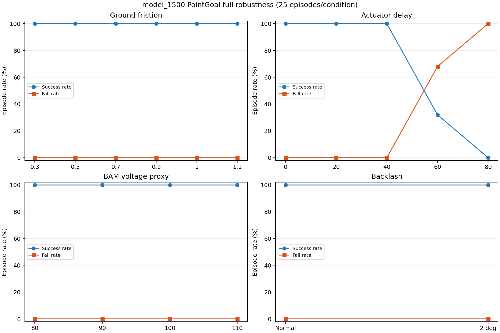
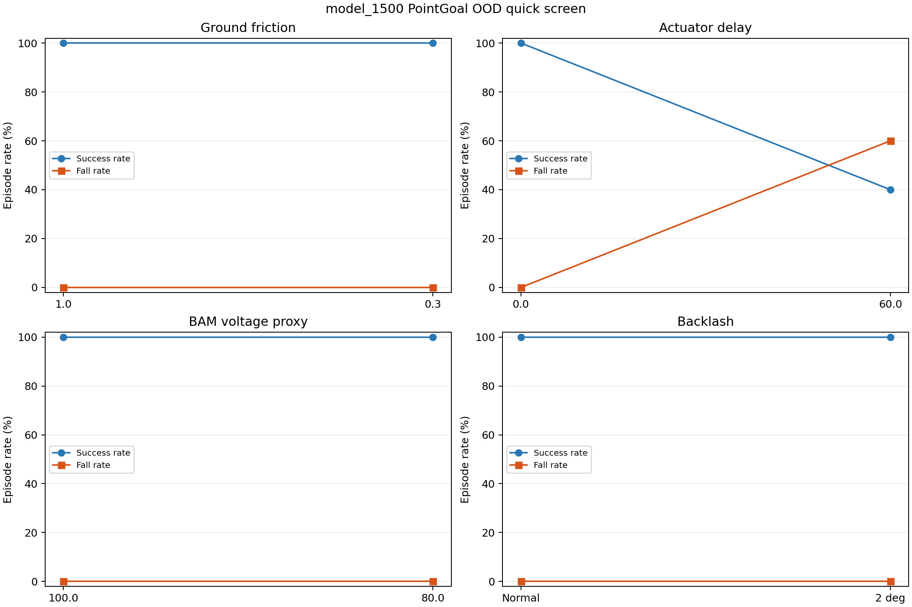

# Week 03 / 07：`model_1500` PointGoal 仿真鲁棒性评测

## 结论

本项实验按“代表性 OOD 快筛 → actuator delay 阈值定位 → 冻结完整矩阵”推进，最终
完成 `14 条件 × 25 Episode = 350 Episode` 的完整 PointGoal 仿真鲁棒性评测。

`model_1500.onnx` 在 Nominal、全部 Ground friction、BAM voltage proxy、backlash
以及 delay `20/40 ms` 条件下均为 `25/25` 到达、0 跌倒、0 超时。只有 delay
`60/80 ms` 未通过完整 Gate：

- `60 ms`：`8/25` 到达、`17/25` 跌倒；
- `80 ms`：`0/25` 到达、`25/25` 跌倒。

因此 14 个条件中有 12 个通过，硬任务/安全失效阈值位于 `(40,60] ms`。完整矩阵
没有发现第二个独立于延迟的任务失败因素，但这只能证明当前冻结仿真扰动范围内的
PointGoal OOD 表现。项目没有实机，本结果不构成 Sim2Real 或真机鲁棒性结论。



## 评测协议

- Policy：`artifacts/week03/06_yaw_only_tracking_candidate/models/model_1500.onnx`
- Policy SHA-256：`533b820c13b3782f2c35bfaa7171c29b095d1b5c121c0fe5d8bef80ab37e785d`
- 官方 `microduck_rl` commit：`062921c4c9f65107e391df042f8de424136213c3`
- ONNX + 官方 MuJoCo + BAM M6；不计算训练 Reward/Return
- 冻结同一 Classical Navigator，动作范围 `[vx,0,wz]`
- 五个目标：`front / front_left / front_right / left / right`
- 完整评测使用配对 reset seeds `42–46`，每目标 5 Episode
- 每次只改变一个因素；各 OOD 条件独立判定，不汇总为一个跨条件 Success Rate

完整 Gate 对每个条件分别要求：总体 Success Rate `≥80%`、每个目标 Success Rate
`≥60%`、Fall Rate `=0`、Timeout Rate `≤20%`、invalid-state rate `=0`、最大左右
镜像 Success Rate gap `≤40%`。

原始 suite summary、Episode 记录和 50 Hz CSV 位于：

```text
artifacts/week03/08_pointgoal_robustness/model_1500/
```

这里的 `08` 是已有本地 artifact 路径，为避免移动约 350 MB 原始数据而保留；Git 中的
实验报告已经统一归入 Week03/07。

## 第一阶段：代表性 OOD 快筛

快筛使用五个代表条件，每条件五个目标、一个配对 seed，共 25 Episode。其安全门槛
只要求 Fall Rate 和 invalid-state rate 为 0。

| 条件 | 到达 | 跌倒 | 中位 Path Efficiency | `vx` RMSE | `wz` RMSE | Safety Gate |
|---|---:|---:|---:|---:|---:|---|
| Nominal | 5/5 | 0/5 | 0.805 | 0.123 | 0.489 | 通过 |
| Friction 0.3 | 5/5 | 0/5 | 0.805 | 0.123 | 0.489 | 通过 |
| Delay 60 ms | 2/5 | 3/5 | 0.583 | 0.177 | 0.952 | **未通过** |
| Motor proxy 80% | 5/5 | 0/5 | 0.799 | 0.126 | 0.421 | 通过 |
| Backlash 2 deg | 5/5 | 0/5 | 0.953 | 0.089 | 0.414 | 通过 |



快筛把 `60 ms` delay 定位为首要安全缺口，但每条件只有五个 Episode，不能据此判断
稳定的方向性规律，也不能把其他三个代表条件的通过写成完整鲁棒性结论。

## 第二阶段：Actuator delay 阈值

保持 ONNX、Controller、五个目标和 reset seeds `42–46` 不变，对
`0/20/40/60 ms` 各运行 25 Episode：

| Action delay | 到达 | 跌倒 | 最低逐目标成功率 | 中位 Path Efficiency | `vx` RMSE | `wz` RMSE | Full Gate |
|---:|---:|---:|---:|---:|---:|---:|---|
| 0 ms | 25/25 | 0/25 | 100% | 0.806 | 0.123 | 0.486 | 通过 |
| 20 ms | 25/25 | 0/25 | 100% | 0.867 | 0.077 | 0.289 | 通过 |
| 40 ms | 25/25 | 0/25 | 100% | 0.852 | 0.068 | 0.270 | 通过 |
| 60 ms | 8/25 | 17/25 | 20% | 0.570 | 0.202 | 1.017 | **未通过** |


`60 ms` 的五类目标成功数为 `2/5、2/5、2/5、1/5、1/5`，说明失败覆盖全部方向，
不是单一左右目标造成。当前 action delay 只能按 20 ms 控制步注入，所以阈值不能
进一步细分到 `(40,60] ms` 内部。

`20/40 ms` 的到达效率和 tracking RMSE 表面优于 Nominal，但零命令平面速度分别
增加 42.1% 和 69.3%，预热漂移分别增加 133.4% 和 340.8%。延迟改变了闭环时序和
步态相位，不能把小延迟解释为对策略有益。

## 第三阶段：完整 350-Episode 矩阵

| 条件 | 到达 | 跌倒 | 中位 Path Efficiency | `vx` RMSE | `wz` RMSE | Gate |
|---|---:|---:|---:|---:|---:|---|
| Nominal | 25/25 | 0/25 | 0.806 | 0.123 | 0.486 | 通过 |
| Friction 0.3 | 25/25 | 0/25 | 0.806 | 0.123 | 0.486 | 通过* |
| Friction 0.5 | 25/25 | 0/25 | 0.806 | 0.123 | 0.486 | 通过* |
| Friction 0.7 | 25/25 | 0/25 | 0.806 | 0.123 | 0.486 | 通过* |
| Friction 0.9 | 25/25 | 0/25 | 0.806 | 0.123 | 0.486 | 通过* |
| Friction 1.1 | 25/25 | 0/25 | 0.812 | 0.120 | 0.483 | 通过 |
| Delay 20 ms | 25/25 | 0/25 | 0.867 | 0.077 | 0.289 | 通过 |
| Delay 40 ms | 25/25 | 0/25 | 0.852 | 0.068 | 0.270 | 通过 |
| Delay 60 ms | 8/25 | 17/25 | 0.570 | 0.202 | 1.017 | **未通过** |
| Delay 80 ms | 0/25 | 25/25 | — | 0.271 | 2.466 | **未通过** |
| Motor proxy 80% | 25/25 | 0/25 | 0.799 | 0.126 | 0.425 | 通过 |
| Motor proxy 90% | 25/25 | 0/25 | 0.799 | 0.124 | 0.453 | 通过 |
| Motor proxy 110% | 25/25 | 0/25 | 0.818 | 0.118 | 0.518 | 通过 |
| Backlash 2 deg | 25/25 | 0/25 | 0.954 | 0.089 | 0.417 | 通过 |

所有条件均为 0 Timeout、0 invalid state，成功率的左右镜像差均为 0。Path Efficiency
只在成功Episode上计算；`80 ms` 没有成功轨迹，因此该项为空。

### Ground friction 的解释边界

Friction `0.3/0.5/0.7/0.9` 的全部 `100` 条对应 CSV 与 Nominal 逐字节一致。运行时
注入已经生效，但当前速度、平地和短距离目标没有进入摩擦受限滑移状态。因此这些条件
只能记为“当前协议未触发退化”，不能声称已经证明对真实低摩擦具有泛化能力。
`friction=1.1` 的轨迹与 Nominal 不同，但仍全部通过。

### Motor proxy 与 backlash 的解释边界

BAM voltage proxy `80/90/110%` 均为 25/25。它改变的是 BAM 供电电压与力矩边界
代理，不等价于覆盖所有真实电机强度、热衰减或电池动态。

Backlash `2 deg` 也为 25/25，且效率表面提高；不能把它解释为齿隙改善策略。该场景中
Policy 仍观察 actuated motor-side joint state，未把 passive output-side backlash joint
作为真实编码器读数反馈给策略，因此只覆盖一种明确边界下的机械齿隙代理。

## 决策

1. `model_1500` 冻结为后续 Classical PointGoal 与高层 Navigator 工作的仿真下层
   基线，同时明确记录 delay `≥60 ms` 时不安全。
2. 项目没有实机，不再用“等待测量真机延迟”阻塞后续工作，也不宣称
   Sim2Real-ready。
3. 若以后独立增强下层鲁棒性，最有证据的单变量候选是 action-delay randomization；
   保持 yaw-only Reward、command sampling 和 curriculum 其余因素不变，并复跑同一
   350-Episode 矩阵与 Nominal Gate。
4. 当前按六周计划进入 Week 4 Classical PointGoal 正式 benchmark，不为了没有实机
   而无限扩展仿真扰动种类。

机器可读关键汇总：

- `summaries/pointgoal_ood_quick_model_1500_processed.json`
- `summaries/pointgoal_delay_threshold_model_1500_processed.json`
- `summaries/pointgoal_robustness_full_model_1500_processed.json`
