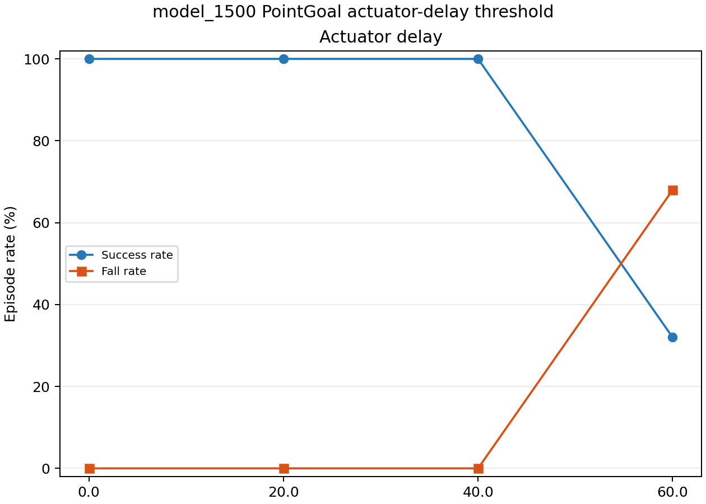

# Week 03 / 07：`model_1500` PointGoal 仿真鲁棒性评测

## 结论

本项实验按“代表性 OOD 快筛 → actuator delay 阈值定位 → 冻结完整矩阵”推进。初版
`pointgoal_ood_v1` 的 Ground friction 注入只修改双足；floor 保持 `1.0` 时，MuJoCo
同优先级接触取较大摩擦值，因此 `0.3/0.5/0.7/0.9` 的实际接触摩擦仍为 `1.0`。旧四行
摩擦结果不再作为低摩擦证据保留。

2026-09-22 已用独立冻结的 `pointgoal_contact_friction_v2` 重跑 Nominal 加五个接触摩擦
条件，完成 `6 条件 × 25 Episode = 150 Episode`。每个摩擦系数同时写入并从 MuJoCo
运行时读回 floor、左脚和右脚。修正后，`model_1500.onnx` 在 Nominal、全部接触摩擦、
BAM voltage proxy、backlash 以及 delay `20/40 ms` 条件下均为 `25/25` 到达、0 跌倒、
0 超时。只有 delay `60/80 ms` 未通过完整 Gate：

- `60 ms`：`8/25` 到达、`17/25` 跌倒；
- `80 ms`：`0/25` 到达、`25/25` 跌倒。

因此修正后的 14 条件证据中仍有 12 条通过，硬任务/安全失效阈值位于 `(40,60] ms`。
接触摩擦 v2 没有出现任务或安全失败，但不同摩擦系数会改变轨迹质量；这只能证明当前
冻结仿真扰动范围内的 PointGoal OOD 表现。项目没有实机，本结果不构成 Sim2Real 或
真机鲁棒性结论。

## 评测协议

- Policy：`artifacts/week03/06_yaw_only_tracking_candidate/models/model_1500.onnx`
- Policy SHA-256：`533b820c13b3782f2c35bfaa7171c29b095d1b5c121c0fe5d8bef80ab37e785d`
- 官方 `microduck_rl` commit：`062921c4c9f65107e391df042f8de424136213c3`
- ONNX + 官方 MuJoCo + BAM M6；不计算训练 Reward/Return
- 冻结同一 Classical Navigator，动作范围 `[vx,0,wz]`
- 五个目标：`front / front_left / front_right / left / right`
- 完整评测使用配对 reset seeds `42–46`，每目标 5 Episode
- 每次只改变一个因素；各 OOD 条件独立判定，不汇总为一个跨条件 Success Rate

完整 Gate 对每个条件分别要求：总体 Success Rate `≥80%`、每个目标 Success Rate
`≥60%`、Fall Rate `=0`、Timeout Rate `≤20%`、invalid-state rate `=0`、最大左右
镜像 Success Rate gap `≤40%`。

原始 suite summary、Episode 记录和 50 Hz CSV 位于：

```text
artifacts/week03/08_pointgoal_robustness/model_1500/
```

这里的 `08` 是已有本地 artifact 路径，为避免移动约 350 MB 原始数据而保留；Git 中的
实验报告已经统一归入 Week03/07。接触摩擦重评测位于其独立子目录
`contact_friction_v2/`，不覆盖旧 v1 raw artifacts。

## 第一阶段：代表性 OOD 快筛

快筛使用五个代表条件，每条件五个目标、一个配对 seed，共 25 Episode。其安全门槛
只要求 Fall Rate 和 invalid-state rate 为 0。

| 条件 | 到达 | 跌倒 | 中位 Path Efficiency | `vx` RMSE | `wz` RMSE | Safety Gate |
|---|---:|---:|---:|---:|---:|---|
| Nominal | 5/5 | 0/5 | 0.805 | 0.123 | 0.489 | 通过 |
| Contact friction 0.3 v2 | 5/5 | 0/5 | 0.897 | 0.127 | 0.379 | 通过 |
| Delay 60 ms | 2/5 | 3/5 | 0.583 | 0.177 | 0.952 | **未通过** |
| Motor proxy 80% | 5/5 | 0/5 | 0.799 | 0.126 | 0.421 | 通过 |
| Backlash 2 deg | 5/5 | 0/5 | 0.953 | 0.089 | 0.414 | 通过 |

快筛把 `60 ms` delay 定位为首要安全缺口，但每条件只有五个 Episode，不能据此判断
稳定的方向性规律。此处的 Contact friction 0.3 已替换为修正后的 v2 quick；其余旧
friction v1 quick 数据只保留在 artifacts 中，不作为低摩擦结论。

## 第二阶段：Actuator delay 阈值

保持 ONNX、Controller、五个目标和 reset seeds `42–46` 不变，对
`0/20/40/60 ms` 各运行 25 Episode：

| Action delay | 到达 | 跌倒 | 最低逐目标成功率 | 中位 Path Efficiency | `vx` RMSE | `wz` RMSE | Full Gate |
|---:|---:|---:|---:|---:|---:|---:|---|
| 0 ms | 25/25 | 0/25 | 100% | 0.806 | 0.123 | 0.486 | 通过 |
| 20 ms | 25/25 | 0/25 | 100% | 0.867 | 0.077 | 0.289 | 通过 |
| 40 ms | 25/25 | 0/25 | 100% | 0.852 | 0.068 | 0.270 | 通过 |
| 60 ms | 8/25 | 17/25 | 20% | 0.570 | 0.202 | 1.017 | **未通过** |



`60 ms` 的五类目标成功数为 `2/5、2/5、2/5、1/5、1/5`，说明失败覆盖全部方向，
不是单一左右目标造成。当前 action delay 只能按 20 ms 控制步注入，所以阈值不能
进一步细分到 `(40,60] ms` 内部。

`20/40 ms` 的到达效率和 tracking RMSE 表面优于 Nominal，但零命令平面速度分别
增加 42.1% 和 69.3%，预热漂移分别增加 133.4% 和 340.8%。延迟改变了闭环时序和
步态相位，不能把小延迟解释为对策略有益。

## 第三阶段：完整 350-Episode 矩阵

| 条件 | 到达 | 跌倒 | 中位 Path Efficiency | `vx` RMSE | `wz` RMSE | Gate |
|---|---:|---:|---:|---:|---:|---|
| Nominal | 25/25 | 0/25 | 0.806 | 0.123 | 0.486 | 通过 |
| Contact friction 0.3 v2 | 25/25 | 0/25 | 0.897 | 0.127 | 0.379 | 通过 |
| Contact friction 0.5 v2 | 25/25 | 0/25 | 0.757 | 0.134 | 0.547 | 通过 |
| Contact friction 0.7 v2 | 25/25 | 0/25 | 0.781 | 0.130 | 0.515 | 通过 |
| Contact friction 0.9 v2 | 25/25 | 0/25 | 0.796 | 0.125 | 0.492 | 通过 |
| Contact friction 1.1 v2 | 25/25 | 0/25 | 0.812 | 0.120 | 0.483 | 通过 |
| Delay 20 ms | 25/25 | 0/25 | 0.867 | 0.077 | 0.289 | 通过 |
| Delay 40 ms | 25/25 | 0/25 | 0.852 | 0.068 | 0.270 | 通过 |
| Delay 60 ms | 8/25 | 17/25 | 0.570 | 0.202 | 1.017 | **未通过** |
| Delay 80 ms | 0/25 | 25/25 | — | 0.271 | 2.466 | **未通过** |
| Motor proxy 80% | 25/25 | 0/25 | 0.799 | 0.126 | 0.425 | 通过 |
| Motor proxy 90% | 25/25 | 0/25 | 0.799 | 0.124 | 0.453 | 通过 |
| Motor proxy 110% | 25/25 | 0/25 | 0.818 | 0.118 | 0.518 | 通过 |
| Backlash 2 deg | 25/25 | 0/25 | 0.954 | 0.089 | 0.417 | 通过 |

所有条件均为 0 Timeout、0 invalid state，成功率的左右镜像差均为 0。Path Efficiency
只在成功Episode上计算；`80 ms` 没有成功轨迹，因此该项为空。

### Ground friction 的解释边界

初版 `pointgoal_ood_v1` 的 `friction_0p3--0p9` 全部 `100` 条 CSV 与 Nominal 逐字节
一致，不是“当前协议未触发摩擦受限”的有效实验发现，而是注入范围不完整：只改足端、
floor 仍为 `1.0`，同优先级接触的有效摩擦保持为 `max(foot, floor)=1.0`。旧
`friction_1p1` 会变化，是因为 `max(1.1, 1.0)=1.1`；它也不再与旧低摩擦行一起解释。

修正后的 `pointgoal_contact_friction_v2` 对每个系数同时写入 floor、左右足端，并在完整
summary 的 `runtime.applied_friction` 中读回三个相同值。`0.3/0.5/0.7/0.9/1.1` 各自
25/25 到达、0 fall、0 timeout、0 invalid state，所有 full gate 通过；但 Path Efficiency
为 `0.897/0.757/0.781/0.796/0.812`，呈非单调变化。因此本协议支持“这些接触摩擦档位
下未发生任务或安全失败”，不支持“摩擦越低越好/越差”的单调因果结论，也不能外推到
真实地面材料、坡度或更激烈动作。

v2 protocol SHA-256 为
`f46ddae3d7858717f70f2621c317ba68e2b844a22746cf22c65bb61a57077479`；full source summary
SHA-256 为
`5766728f544072dc6ed36facac2fb7d1de7b4d7747b9b6d11057af50846e5034`。原始 v2 结果位于
`artifacts/week03/08_pointgoal_robustness/model_1500/contact_friction_v2/full/`。

### Motor proxy 与 backlash 的解释边界

BAM voltage proxy `80/90/110%` 均为 25/25。它改变的是 BAM 供电电压与力矩边界
代理，不等价于覆盖所有真实电机强度、热衰减或电池动态。

Backlash `2 deg` 也为 25/25，且效率表面提高；不能把它解释为齿隙改善策略。该场景中
Policy 仍观察 actuated motor-side joint state，未把 passive output-side backlash joint
作为真实编码器读数反馈给策略，因此只覆盖一种明确边界下的机械齿隙代理。

## 第二层扩展：Mass 与低层传感器噪声

第二层继续使用同一 `model_1500.onnx`、Controller、目标集和配对 seeds，新增独立
冻结配置 `evaluation/robustness_configs/pointgoal_sensor_mass_v1.json`。六个
快筛条件为 Mass/Inertia `90/110%`、IMU Noise Low/High 和 Joint Encoder Noise
Low/High。

2026-09-19 先对三个因素各运行一个 `front / seed 42 / 5 s` 非正式 smoke：

| 代表条件 | 跌倒 / invalid | 注入核对 |
|---|---:|---|
| Mass/Inertia 90% | 0 / 0 | trunk mass `0.199224 → 0.1793016`，mass/inertia ratio 均为 `0.9` |
| IMU Noise High | 0 / 0 | 只改变 Observation `0:6`；首步最大差 `0.050914 ≤ 0.06` |
| Encoder Noise High | 0 / 0 | 只改变 `6:34`；首步 position/velocity 最大差 `0.001914/0.480545`，均在边界内 |

三个 Episode 均因5秒 smoke 时限而未到达1.5米外目标，不能据此判定鲁棒性通过或失败。
它们只证明质量/惯量和两类 Observation 注入按配置生效；原始 CSV 与 smoke summary
保存在 `artifacts/week03/08_pointgoal_robustness/model_1500/smoke/`。

### 30-Episode 快筛

快筛使用六个条件 × 五个对称目标 × seed 42：

| 条件 | 到达 | 跌倒 | Path Efficiency | `vx` RMSE | `wz` RMSE | Safety Gate |
|---|---:|---:|---:|---:|---:|---|
| Mass/Inertia 90% | 5/5 | 0/5 | 0.812 | 0.120 | 0.515 | 通过 |
| Mass/Inertia 110% | 5/5 | 0/5 | 0.798 | 0.125 | 0.469 | 通过 |
| IMU Noise Low | 5/5 | 0/5 | 0.803 | 0.123 | 0.488 | 通过 |
| IMU Noise High | 5/5 | 0/5 | 0.801 | 0.125 | 0.492 | 通过 |
| Encoder Noise Low | 5/5 | 0/5 | 0.806 | 0.123 | 0.498 | 通过 |
| Encoder Noise High | 5/5 | 0/5 | 0.807 | 0.123 | 0.492 | 通过 |

合计30/30到达、0跌倒、0超时、0 invalid state，所有左右镜像成功率差均为0。
相对同一 seed 42 Nominal，IMU High 的零命令 yaw RMS 增加15.2%，Encoder High 的
预热平面漂移增加15.5%，Mass 90%的零命令平面速度增加12.4%；这些变化尚未伴随
任务或安全失败，也只有单个 reset seed，因此只作为正式矩阵需要观察的信号。

快筛通过，可以升级到冻结的六条件 × 25 Episode 正式矩阵。扩展原始数据使用独立
`sensor_mass_v1/` 子目录，避免与此前核心四因素矩阵混合。

### 150-Episode 正式扩展矩阵

正式矩阵使用 seeds 42–46；每个条件覆盖五个对称目标，每目标五个 Episode。下表中的
Nominal 是第一层完整矩阵中同一组目标与 seeds 的 25-Episode 配对参考，不计入本次
150 Episode：

| 条件 | 到达 | Path Efficiency | 完成时间 / s | `vx` RMSE | `wz` RMSE | 零命令 `wz` RMS | 预热 `|Δyaw|` / rad | Full Gate |
|---|---:|---:|---:|---:|---:|---:|---:|---|
| Nominal 参考 | 25/25 | 0.806 | 12.38 | 0.123 | 0.486 | 0.167 | 0.019 | 参考 |
| Mass/Inertia 90% | 25/25 | 0.813 | 12.10 | 0.119 | 0.519 | 0.185 | 0.025 | 通过 |
| Mass/Inertia 110% | 25/25 | 0.798 | 12.62 | 0.125 | 0.466 | 0.161 | 0.017 | 通过 |
| IMU Noise Low | 25/25 | 0.806 | 12.34 | 0.123 | 0.488 | 0.179 | 0.012 | 通过 |
| IMU Noise High | 25/25 | 0.804 | 12.48 | 0.123 | 0.492 | 0.182 | 0.028 | 通过 |
| Encoder Noise Low | 25/25 | 0.806 | 12.36 | 0.123 | 0.488 | 0.173 | 0.011 | 通过 |
| Encoder Noise High | 25/25 | 0.803 | 12.38 | 0.123 | 0.494 | 0.187 | 0.033 | 通过 |

六个条件合计150/150到达，0跌倒、0超时、0 invalid state；每个目标到达率均为
100%，左右镜像成功率差均为0，六个 Full Gate 全部通过。相对 Nominal，Path
Efficiency 的最大绝对变化为1.0%，中位完成时间最大变化为2.3%，因此没有发现会改变
当前 PointGoal 任务结论的任务级退化。

细粒度指标仍显示 yaw 对扰动更敏感：Mass 90%的零命令 `wz` RMS 增加11.1%，IMU
High 的预热绝对 yaw 漂移增加49.3%，Encoder High 的零命令 `wz` RMS 增加12.2%、
预热绝对 yaw 漂移增加75.4%。但预热 yaw 的 Nominal 绝对值仅0.019 rad，Encoder
High 也只有0.033 rad，且没有伴随任务或安全失败，所以把它记录为敏感性信号，不单独
判为失败。快筛中 Encoder High 的预热平面漂移增加15.5%没有在五 seeds 中保持；
正式中位数反而比 Nominal 低21.8%，说明不能用单 seed 快筛波动下稳定退化结论。

该结论只覆盖 `trunk_base` mass/inertia ±10% 与逐控制步 iid uniform actor
observation noise。Navigator 仍使用仿真真值位姿；常量偏置、安装误差、长期漂移、
量化、丢包、定位误差和真实硬件噪声分布均不在本协议内，因此不能据此宣称
Sim2Real-ready。

## 决策

1. `model_1500` 冻结为后续 Classical PointGoal 与高层 Navigator 工作的仿真下层
   基线，同时明确记录 delay `≥60 ms` 时不安全。
2. 项目没有实机，不再用“等待测量真机延迟”阻塞后续工作，也不宣称
   Sim2Real-ready。
3. 若以后独立增强下层鲁棒性，最有证据的单变量候选是 action-delay randomization；
   保持 yaw-only Reward、command sampling 和 curriculum 其余因素不变，并复跑同一
   接触摩擦 v2 与 delay Gate。
4. 第二层150-Episode正式矩阵已通过；至此关闭第三周的有界鲁棒性扩展，进入
   Week 4，不继续无证据增加仿真扰动种类。

机器可读关键汇总：

- `summaries/pointgoal_ood_quick_model_1500_processed.json`
- `summaries/pointgoal_delay_threshold_model_1500_processed.json`
- `summaries/pointgoal_robustness_full_model_1500_processed.json`
- `summaries/pointgoal_contact_friction_v2_full_model_1500_processed.json`
- `summaries/pointgoal_sensor_mass_quick_model_1500_processed.json`
- `summaries/pointgoal_sensor_mass_full_model_1500_processed.json`
